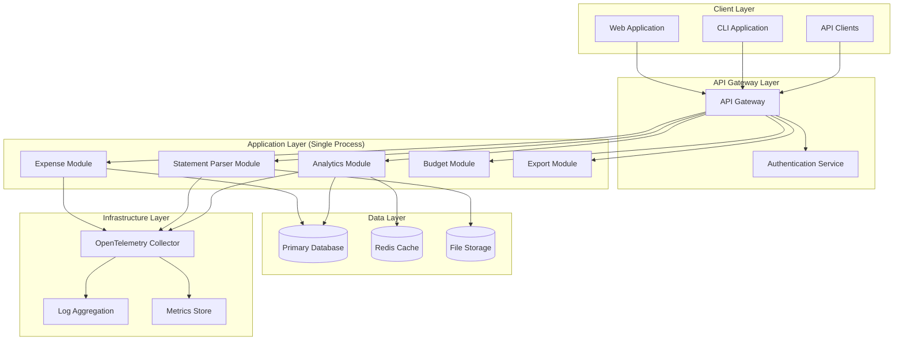
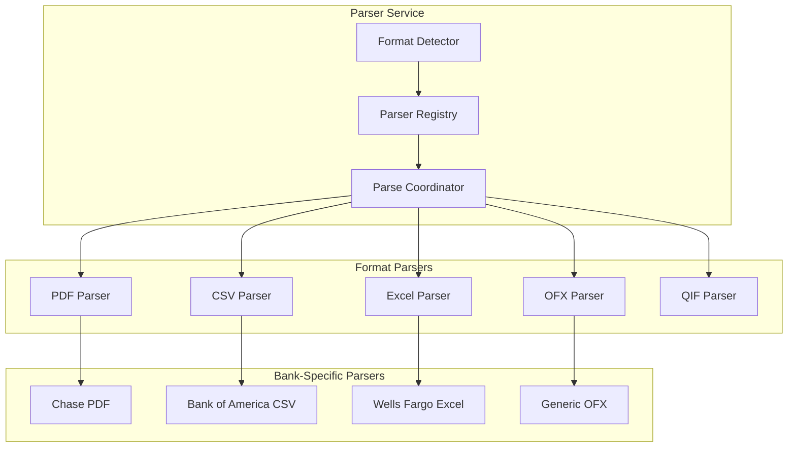
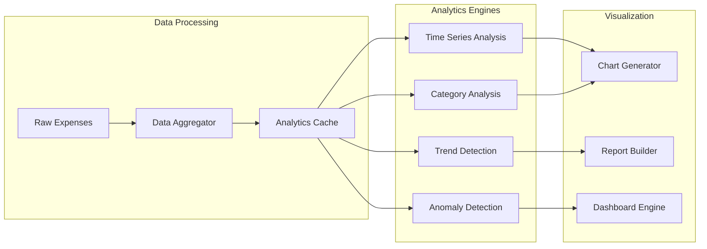

# Design Document

## Overview

The expense tracker system is designed as a modern, cloud-native application with a modular monolith architecture that supports multiple interfaces (Web, API, CLI) and provides comprehensive financial data management. The system uses microservices design principles (separation of concerns, clear interfaces, modularity) but implements them as distinct modules within a single deployable application. This approach provides the benefits of modular design while avoiding the operational complexity of distributed systems.

### Key Design Principles

- **Modular Architecture**: Pluggable components for statement parsing and data processing
- **Interface Agnostic**: Consistent functionality across web, API, and CLI interfaces
- **Observability First**: Comprehensive logging, metrics, and tracing using OpenTelemetry
- **Data-Driven Analytics**: Rich analytics engine with multiple visualization perspectives
- **Security by Design**: End-to-end encryption and secure authentication

## Architecture

### High-Level Architecture



### Technology Stack

- **Architecture**: Modular monolith (single deployable application with modular internal structure)
- **Backend**: Python + FastAPI
- **Database**: PostgreSQL via Supabase (includes auth, real-time, file storage)
- **API**: FastAPI with automatic OpenAPI documentation
- **Web Frontend**: React + TypeScript + Shadcn/ui + Tailwind CSS
- **CLI**: Python Click framework
- **Charts/Analytics**: Recharts for React, Plotly for advanced analytics
- **Observability**: OpenTelemetry, Supabase Analytics
- **File Processing**: Python libraries (PyPDF2, pandas, openpyxl, etc.)
- **Authentication**: Supabase Auth (JWT-based)
- **Deployment**: 
  - Backend: Railway/Fly.io/Render
  - Frontend: Vercel/Netlify
  - Database: Supabase (managed PostgreSQL)
  - File Storage: Supabase Storage

## Components and Interfaces

### 1. Statement Parser Service

The core innovation of the system - a modular, extensible parsing engine.

#### Parser Architecture



#### Parser Interface

```typescript
interface StatementParser {
  canParse(file: File, metadata: FileMetadata): boolean;
  parse(file: File): Promise<ParseResult>;
  getConfiguration(): ParserConfiguration;
}

interface ParseResult {
  transactions: Transaction[];
  metadata: StatementMetadata;
  errors: ParseError[];
  confidence: number;
}
```

#### Configuration-Driven Parsers

Parsers are configured through JSON/YAML files that define:
- Field mappings
- Date formats
- Amount parsing rules
- Category detection patterns
- Validation rules

### 2. Expense Service

Core business logic for expense management.

#### Key Responsibilities
- CRUD operations for expenses
- Category management and assignment
- Recurring expense handling
- Data validation and business rules

#### API Endpoints
```
POST   /api/expenses              - Create expense
GET    /api/expenses              - List expenses (with filtering)
GET    /api/expenses/:id          - Get specific expense
PUT    /api/expenses/:id          - Update expense
DELETE /api/expenses/:id          - Delete expense
POST   /api/expenses/bulk         - Bulk import from parsed statements
```

### 3. Analytics Service

Advanced analytics engine providing multiple data perspectives.

#### Analytics Architecture



#### Analytics Views
- **Temporal Views**: Daily, weekly, monthly, yearly trends
- **Category Views**: Spending by category with drill-down
- **Comparative Views**: Period-over-period comparisons
- **Pattern Views**: Recurring patterns and anomalies
- **Account Views**: Spending by payment method/account
- **Custom Views**: User-defined analytics dashboards

### 4. Multi-Interface Layer

#### Web Application
- React + TypeScript SPA with Shadcn/ui components
- Tailwind CSS for styling with dark/light mode support
- Recharts for beautiful data visualizations and analytics
- Real-time updates using Supabase real-time subscriptions
- Progressive Web App (PWA) capabilities
- Drag-and-drop file uploads with react-dropzone
- Responsive design optimized for mobile and desktop

#### REST API
- OpenAPI 3.0 specification
- Comprehensive endpoint coverage
- Rate limiting and authentication
- Webhook support for integrations

#### CLI Application
- Full feature parity with web interface
- Batch operations support
- Configuration file support
- Output formatting options (JSON, table, CSV)

```bash
# Example CLI commands (Python Click)
expense-tracker add --amount 25.50 --category food --description "Lunch"
expense-tracker import --file statement.pdf --bank chase
expense-tracker report --period monthly --category all --format table
expense-tracker budget set --category food --limit 500
expense-tracker analytics --view trends --export chart.png
```

## Data Models

### Core Entities

```typescript
interface Expense {
  id: string;
  amount: number;
  description: string;
  category: Category;
  date: Date;
  paymentMethod: PaymentMethod;
  account?: Account;
  notes?: string;
  attachments?: Attachment[];
  tags?: string[];
  isRecurring: boolean;
  recurringPattern?: RecurringPattern;
  createdAt: Date;
  updatedAt: Date;
}

interface Category {
  id: string;
  name: string;
  color: string;
  icon?: string;
  parentCategory?: Category;
  isCustom: boolean;
  budgetLimit?: number;
}

interface Budget {
  id: string;
  name: string;
  period: 'monthly' | 'yearly' | 'custom';
  categories: CategoryBudget[];
  totalLimit?: number;
  startDate: Date;
  endDate?: Date;
}

interface ParsedStatement {
  id: string;
  filename: string;
  format: string;
  bankName?: string;
  accountNumber?: string;
  statementPeriod: DateRange;
  transactions: ParsedTransaction[];
  parseMetadata: ParseMetadata;
  status: 'pending' | 'reviewed' | 'imported';
}
```

### Database Schema Design

```sql
-- Core tables with proper indexing for analytics
CREATE TABLE expenses (
    id UUID PRIMARY KEY,
    amount DECIMAL(10,2) NOT NULL,
    description TEXT,
    category_id UUID REFERENCES categories(id),
    expense_date DATE NOT NULL,
    payment_method_id UUID REFERENCES payment_methods(id),
    account_id UUID REFERENCES accounts(id),
    created_at TIMESTAMP DEFAULT NOW(),
    updated_at TIMESTAMP DEFAULT NOW()
);

-- Optimized indexes for common query patterns
CREATE INDEX idx_expenses_date ON expenses(expense_date);
CREATE INDEX idx_expenses_category ON expenses(category_id);
CREATE INDEX idx_expenses_amount ON expenses(amount);
CREATE INDEX idx_expenses_composite ON expenses(expense_date, category_id, amount);
```

## Error Handling

### Error Classification
- **Validation Errors**: Input validation failures
- **Business Logic Errors**: Rule violations (budget exceeded, etc.)
- **Integration Errors**: External service failures
- **System Errors**: Infrastructure and runtime errors

### Error Response Format
```typescript
interface ErrorResponse {
  error: {
    code: string;
    message: string;
    details?: any;
    timestamp: string;
    traceId: string;
  };
}
```

### Parsing Error Handling
- Graceful degradation for partial parsing failures
- Manual correction workflows for failed transactions
- Confidence scoring for parsed data
- Rollback capabilities for bulk imports

## Testing Strategy

### Testing Pyramid

#### Unit Tests (70%)
- Individual service methods
- Parser logic for each format
- Analytics calculations
- Validation functions

#### Integration Tests (20%)
- API endpoint testing
- Database integration
- Parser service integration
- Authentication flows

#### End-to-End Tests (10%)
- Complete user workflows
- Cross-interface consistency
- Performance benchmarks
- Security penetration testing

### Test Data Strategy
- Synthetic bank statements for each supported format
- Anonymized real data for edge case testing
- Performance test datasets with varying sizes
- Security test scenarios

### Continuous Testing
- Automated test execution on code changes
- Performance regression testing
- Security vulnerability scanning
- Accessibility compliance testing

## Observability and Monitoring

### OpenTelemetry Implementation

#### Distributed Tracing
```typescript
// Example tracing implementation
import { trace } from '@opentelemetry/api';

const tracer = trace.getTracer('expense-tracker');

async function parseStatement(file: File): Promise<ParseResult> {
  return tracer.startActiveSpan('parse-statement', async (span) => {
    span.setAttributes({
      'file.name': file.name,
      'file.size': file.size,
      'file.type': file.type
    });
    
    try {
      const result = await performParsing(file);
      span.setAttributes({
        'parse.success': true,
        'parse.transaction_count': result.transactions.length
      });
      return result;
    } catch (error) {
      span.recordException(error);
      span.setStatus({ code: SpanStatusCode.ERROR });
      throw error;
    } finally {
      span.end();
    }
  });
}
```

#### Metrics Collection
- Request/response metrics
- Business metrics (expenses created, statements parsed)
- System metrics (CPU, memory, disk usage)
- Custom analytics metrics

#### Structured Logging
```typescript
import { logger } from './logger';

logger.info('Statement parsed successfully', {
  userId: user.id,
  filename: file.name,
  transactionCount: result.transactions.length,
  parseTime: performance.now() - startTime,
  traceId: span.spanContext().traceId
});
```

### Monitoring Dashboards
- System health and performance
- Business KPIs (active users, expenses tracked)
- Error rates and response times
- Parser success rates by format/bank

## Security Considerations

### Authentication and Authorization
- JWT-based authentication with refresh tokens
- Role-based access control (RBAC)
- API key management for programmatic access
- Multi-factor authentication support

### Data Protection
- Encryption at rest for sensitive financial data
- TLS 1.3 for data in transit
- PII tokenization for analytics
- Secure file upload with virus scanning

### Privacy Compliance
- GDPR compliance for EU users
- Data retention policies
- User data export capabilities
- Right to deletion implementation

### Security Monitoring
- Failed authentication attempt tracking
- Suspicious activity detection
- Regular security audits
- Vulnerability scanning

This design provides a robust, scalable foundation for the expense tracker system with particular attention to the modular parsing architecture, comprehensive analytics, and enterprise-grade observability that you requested.