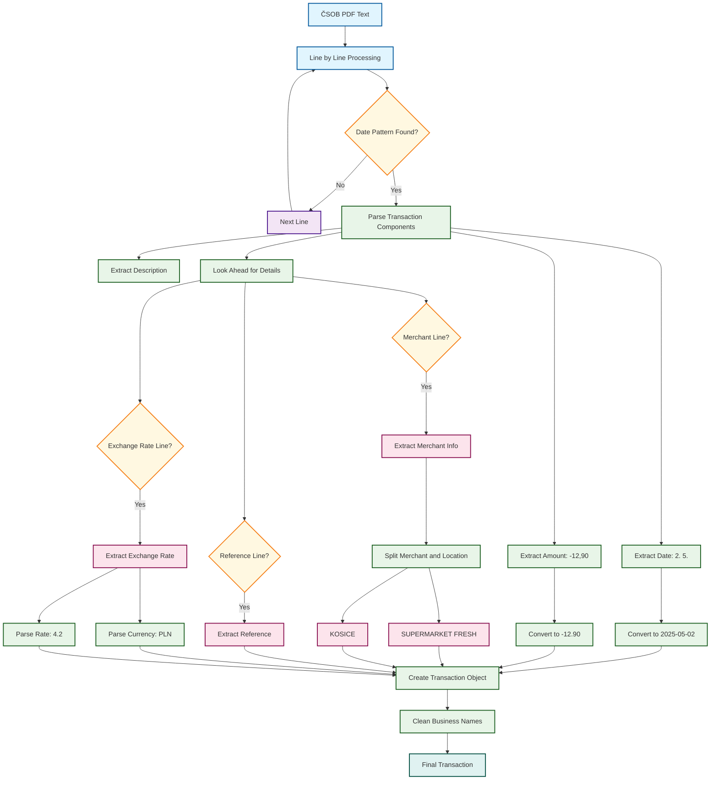
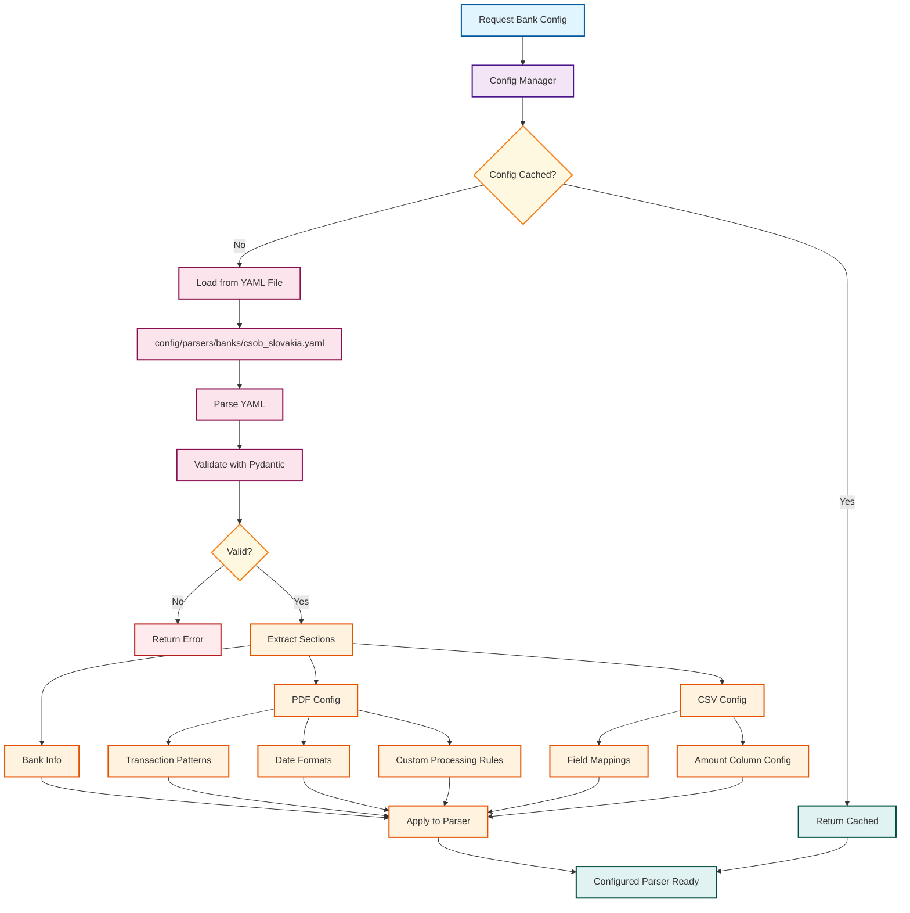
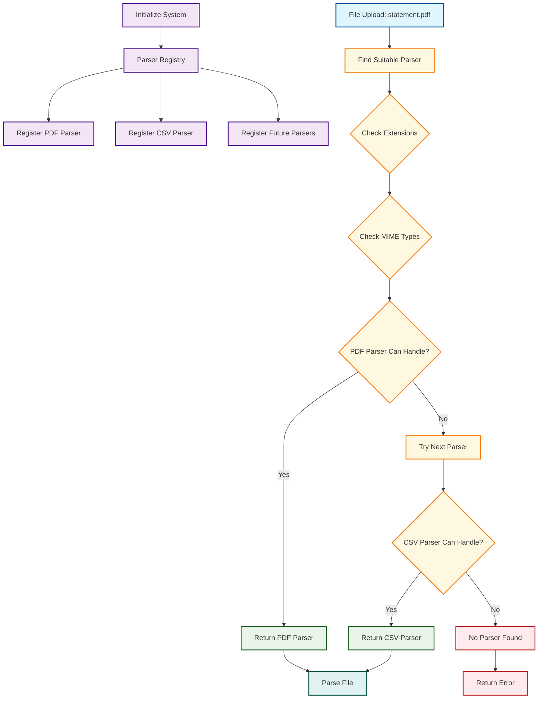
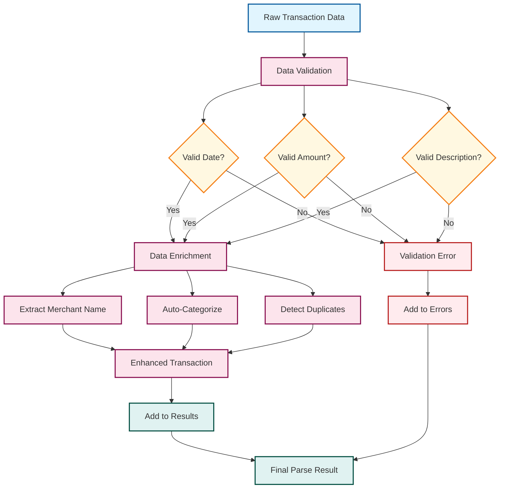
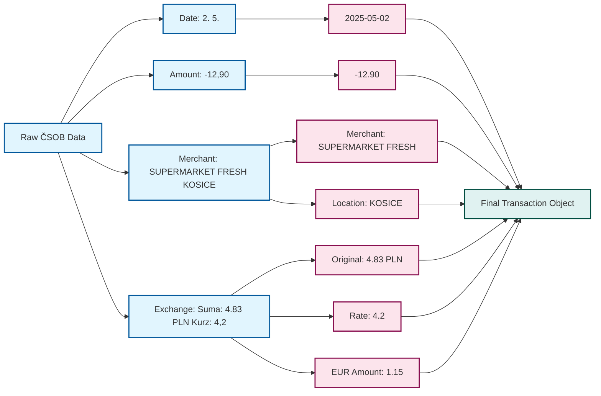
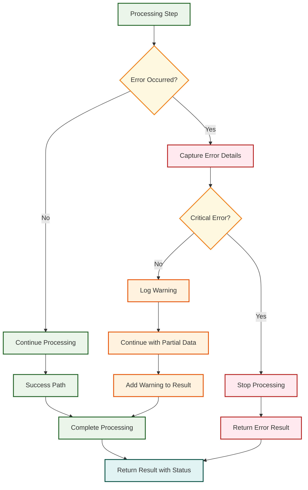
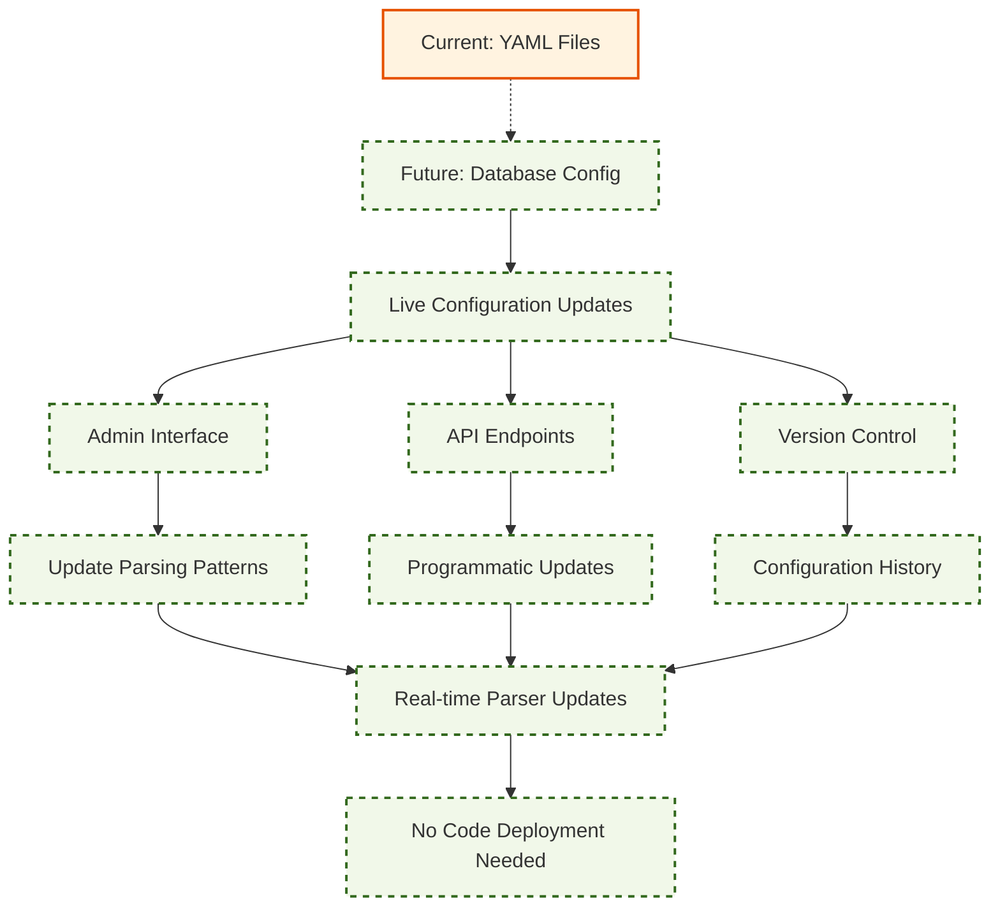

# Comprehensive Parsing Architecture Diagram

## 🎨 Color Coding Legend

All diagrams use consistent color coding to represent different types of components:

- 🔵 **Blue** (`#e1f5fe`) - **User Input & Interface** - User interactions, file uploads, UI components
- 🟣 **Purple** (`#f3e5f5`) - **Detection & Registry** - File detection, parser registry, system initialization
- 🟢 **Green** (`#e8f5e8`) - **Parsers & Processing** - PDF/CSV parsers, data processing, transformations
- 🟠 **Orange** (`#fff3e0`) - **Configuration** - Config management, bank settings, YAML files
- 🟡 **Pink** (`#fce4ec`) - **Data Operations** - Validation, enrichment, extraction, analysis
- 🟢 **Teal** (`#e0f2f1`) - **Results & Output** - Final results, success states, output formats
- 🔴 **Red** (`#ffebee`) - **Errors & Failures** - Error handling, validation failures, exceptions
- 🟡 **Yellow** (`#fff8e1`) - **Decisions** - Decision points, conditional logic, branching
- 🟢 **Light Green** (`#f1f8e9`) - **Future Features** - Planned enhancements, roadmap items (dashed borders)

## 1. Complete Parsing Process Overview

```mermaid
flowchart TD
    %% User Input
    User["👤 User"] --> Upload["📤 File Upload"]
    Upload --> FileInput["📄 Input File<br/>statement.pdf<br/>transactions.csv"]
    
    %% File Detection Phase
    FileInput --> FileDetector["🔍 File Detector"]
    FileDetector --> ExtCheck{"Extension<br/>Check"}
    FileDetector --> MimeCheck{"MIME Type<br/>Check"}
    FileDetector --> SizeCheck{"Size<br/>Validation"}
    FileDetector --> EncodingCheck{"Encoding<br/>Detection"}
    
    ExtCheck -->|".pdf"| PDFDetected["📄 PDF Detected"]
    ExtCheck -->|".csv"| CSVDetected["📊 CSV Detected"]
    ExtCheck -->|".xlsx"| ExcelDetected["📈 Excel Detected<br/>Future: Task 7"]
    ExtCheck -->|"unknown"| UnsupportedFormat["❌ Unsupported Format"]
    
    %% Parser Registry Phase
    PDFDetected --> ParserRegistry["🏛️ Parser Registry"]
    CSVDetected --> ParserRegistry
    ExcelDetected --> ParserRegistry
    
    ParserRegistry --> FindParser{"Find Suitable<br/>Parser"}
    FindParser -->|"PDF"| PDFParser["📄 PDF Parser"]
    FindParser -->|"CSV"| CSVParser["📊 CSV Parser"]
    FindParser -->|"Excel"| ExcelParser["📈 Excel Parser<br/>Task 7"]
    FindParser -->|"None"| NoParser["❌ No Parser Found"]
    
    %% Configuration Loading Phase
    PDFParser --> LoadConfig["⚙️ Load Configuration"]
    CSVParser --> LoadConfig
    
    LoadConfig --> ConfigManager["🔧 Config Manager"]
    ConfigManager --> BankConfigs["📁 Bank Configs<br/>YAML Files"]
    BankConfigs --> CSObConfig["🏦 ČSOB Slovakia"]
    BankConfigs --> ChaseConfig["🏦 Chase Bank"]
    BankConfigs --> BOAConfig["🏦 Bank of America"]
    BankConfigs --> WellsConfig["🏦 Wells Fargo"]
    BankConfigs --> AmexConfig["🏦 American Express"]
    
    %% PDF Parsing Branch
    PDFParser --> PDFExtraction["📄 PDF Text Extraction"]
    PDFExtraction --> PDFPlumber{"pdfplumber<br/>Available?"}
    PDFExtraction --> PyPDF2{"PyPDF2<br/>Available?"}
    
    PDFPlumber -->|"Yes"| PlumberExtract["📖 pdfplumber Extract"]
    PyPDF2 -->|"Yes"| PyPDF2Extract["📖 PyPDF2 Extract"]
    PDFPlumber -->|"No"| PyPDF2
    PyPDF2 -->|"No"| PDFError["❌ No PDF Library"]
    
    PlumberExtract --> PDFText["📝 Raw PDF Text"]
    PyPDF2Extract --> PDFText
    
    PDFText --> PDFProcessing["🔄 PDF Processing"]
    PDFProcessing --> TextPatterns["🔍 Text Pattern Matching"]
    PDFProcessing --> TableExtraction["📊 Table Extraction"]
    
    %% ČSOB Specific Processing
    TextPatterns --> CSObDetection{"ČSOB Format<br/>Detected?"}
    CSObDetection -->|"Yes"| CSObProcessing["🏦 ČSOB Specific Processing"]
    CSObDetection -->|"No"| GenericProcessing["🔄 Generic PDF Processing"]
    
    CSObProcessing --> CSObDateParse["📅 Slovak Date Parsing<br/>2. 5. to 2025-05-02"]
    CSObProcessing --> CSObAmountParse["💰 Slovak Amount Parsing<br/>-12,90 to -12.90"]
    CSObProcessing --> CSObMerchantSplit["🏪 Merchant/Location Split<br/>SUPERMARKET FRESH KOSICE"]
    CSObProcessing --> CSObExchangeRate["💱 Exchange Rate Parsing<br/>PLN, CZK, USD to EUR"]
    CSObProcessing --> CSObTransactionType["🔍 Transaction Type Detection<br/>Card Payment, Transfer, etc."]
    CSObProcessing --> CSObBusinessCleanup["🧹 Business Name Cleanup<br/>Remove S.R.O., A.S."]
    
    CSObDateParse --> CSObTransactions["📋 ČSOB Transactions"]
    CSObAmountParse --> CSObTransactions
    CSObMerchantSplit --> CSObTransactions
    CSObExchangeRate --> CSObTransactions
    CSObTransactionType --> CSObTransactions
    CSObBusinessCleanup --> CSObTransactions
    
    GenericProcessing --> GenericTransactions["📋 Generic Transactions"]
    TableExtraction --> TableTransactions["📋 Table Transactions"]
    
    %% CSV Parsing Branch
    CSVParser --> CSVReading["📊 CSV Reading"]
    CSVReading --> PandasRead["🐼 Pandas DataFrame"]
    PandasRead --> FieldMapping["🗺️ Field Mapping"]
    
    FieldMapping --> DateMapping["📅 Date Column Mapping"]
    FieldMapping --> DescMapping["📝 Description Mapping"]
    FieldMapping --> AmountMapping["💰 Amount Column Mapping"]
    FieldMapping --> CategoryMapping["🏷️ Category Mapping"]
    
    DateMapping --> CSVProcessing["🔄 CSV Processing"]
    DescMapping --> CSVProcessing
    AmountMapping --> CSVProcessing
    CategoryMapping --> CSVProcessing
    
    CSVProcessing --> DebitCredit{"Separate Debit/<br/>Credit Columns?"}
    DebitCredit -->|"Yes"| SeparateColumns["📊 Process Separate Columns"]
    DebitCredit -->|"No"| SingleColumn["📊 Process Single Amount Column"]
    
    SeparateColumns --> CSVTransactions["📋 CSV Transactions"]
    SingleColumn --> CSVTransactions
    
    %% Transaction Processing Phase
    CSObTransactions --> TransactionValidation["✅ Transaction Validation"]
    GenericTransactions --> TransactionValidation
    TableTransactions --> TransactionValidation
    CSVTransactions --> TransactionValidation
    
    TransactionValidation --> ValidateDate{"Valid Date?"}
    TransactionValidation --> ValidateAmount{"Valid Amount?"}
    TransactionValidation --> ValidateDescription{"Valid Description?"}
    
    ValidateDate -->|"No"| ValidationError["❌ Validation Error"]
    ValidateAmount -->|"No"| ValidationError
    ValidateDescription -->|"No"| ValidationError
    
    ValidateDate -->|"Yes"| TransactionEnrichment["🔧 Transaction Enrichment"]
    ValidateAmount -->|"Yes"| TransactionEnrichment
    ValidateDescription -->|"Yes"| TransactionEnrichment
    
    TransactionEnrichment --> MerchantExtraction["🏪 Merchant Name Extraction"]
    TransactionEnrichment --> Categorization["🏷️ Auto-Categorization"]
    TransactionEnrichment --> DuplicateDetection["🔍 Duplicate Detection"]
    
    MerchantExtraction --> EnrichedTransactions["✨ Enriched Transactions"]
    Categorization --> EnrichedTransactions
    DuplicateDetection --> EnrichedTransactions
    
    %% Result Assembly Phase
    EnrichedTransactions --> ResultAssembly["📦 Result Assembly"]
    ValidationError --> ResultAssembly
    
    ResultAssembly --> ParseResult["📊 Parse Result"]
    ParseResult --> Success{"Success?"}
    
    Success -->|"Yes"| SuccessResult["✅ Success Result<br/>• Transactions List<br/>• Metadata<br/>• Statistics"]
    Success -->|"No"| ErrorResult["❌ Error Result<br/>• Error Messages<br/>• Warnings<br/>• Partial Data"]
    
    %% Output Phase
    SuccessResult --> OutputFormat{"Output Format"}
    ErrorResult --> OutputFormat
    
    OutputFormat --> JSONOutput["📄 JSON Output"]
    OutputFormat --> DatabaseSave["💾 Database Save"]
    OutputFormat --> APIResponse["🌐 API Response"]
    OutputFormat --> UIDisplay["🖥️ UI Display"]
    
    %% Standard color scheme for all diagrams
    classDef userClass fill:#e1f5fe,stroke:#01579b,stroke-width:2px
    classDef detectionClass fill:#f3e5f5,stroke:#4a148c,stroke-width:2px
    classDef parserClass fill:#e8f5e8,stroke:#1b5e20,stroke-width:2px
    classDef configClass fill:#fff3e0,stroke:#e65100,stroke-width:2px
    classDef dataClass fill:#fce4ec,stroke:#880e4f,stroke-width:2px
    classDef resultClass fill:#e0f2f1,stroke:#004d40,stroke-width:2px
    classDef errorClass fill:#ffebee,stroke:#b71c1c,stroke-width:2px
    classDef decisionClass fill:#fff8e1,stroke:#f57f17,stroke-width:2px
    classDef futureClass fill:#f1f8e9,stroke:#33691e,stroke-width:2px,stroke-dasharray: 5 5
    
    %% Apply colors to user input components
    class User,Upload,FileInput userClass
    
    %% Apply colors to detection components
    class FileDetector,ExtCheck,MimeCheck,SizeCheck,EncodingCheck,PDFDetected,CSVDetected,ExcelDetected detectionClass
    
    %% Apply colors to parser components
    class ParserRegistry,FindParser,PDFParser,CSVParser,ExcelParser,PDFExtraction,PDFPlumber,PyPDF2,PlumberExtract,PyPDF2Extract parserClass
    
    %% Apply colors to configuration components
    class LoadConfig,ConfigManager,BankConfigs,CSObConfig,ChaseConfig,BOAConfig,WellsConfig,AmexConfig configClass
    
    %% Apply colors to data processing components
    class PDFText,PDFProcessing,TextPatterns,TableExtraction,CSObProcessing,GenericProcessing,CSObDateParse,CSObAmountParse,CSObMerchantSplit,CSObExchangeRate,CSObTransactionType,CSObBusinessCleanup,CSVReading,PandasRead,FieldMapping,DateMapping,DescMapping,AmountMapping,CategoryMapping,CSVProcessing,SeparateColumns,SingleColumn,TransactionValidation,TransactionEnrichment,MerchantExtraction,Categorization,DuplicateDetection dataClass
    
    %% Apply colors to decision components
    class CSObDetection,DebitCredit,ValidateDate,ValidateAmount,ValidateDescription,Success decisionClass
    
    %% Apply colors to result components
    class CSObTransactions,GenericTransactions,TableTransactions,CSVTransactions,EnrichedTransactions,ResultAssembly,ParseResult,Success,SuccessResult,OutputFormat,JSONOutput,DatabaseSave,APIResponse,UIDisplay resultClass
    
    %% Apply colors to error components
    class UnsupportedFormat,NoParser,PDFError,ValidationError,ErrorResult errorClass
    
    %% Apply colors to future components
    class ExcelDetected,ExcelParser futureClass
```

## 2. ČSOB PDF Processing Detail

## 3. Configuration System Flow

## 4. Parser Registry System

## 5. Transaction Data Flow

## 6. ČSOB Specific Data Transformations

## 7. Error Handling Flow

## 8. Future Database Configuration

## Key Components Explained

### 🔍 File Detection

- Checks file extension (.pdf, .csv)
- Validates MIME type
- Detects file encoding
- Validates file size

### 🏛️ Parser Registry

- Maintains list of available parsers
- Matches files to appropriate parsers
- Handles parser initialization
- Supports dynamic parser registration

### 🏦 ČSOB Specific Processing

- **Date Parsing**: "2. 5." → 2025-05-02
- **Amount Parsing**: "-12,90" → -12.90
- **Merchant Splitting**: "SUPERMARKET FRESH KOSICE" → merchant + location
- **Exchange Rates**: "Suma: 4.83 PLN Kurz: 4,2" → multi-currency support
- **Business Cleanup**: Remove S.R.O., A.S. suffixes

### ⚙️ Configuration System

- YAML-based bank configurations
- Pydantic validation
- Caching for performance
- Future database migration ready

### ✅ Data Validation & Enrichment

- Validates required fields
- Extracts merchant names
- Auto-categorizes transactions
- Detects duplicates
- Handles errors gracefully

This architecture is **modular**, **extensible**, and **production-ready**!