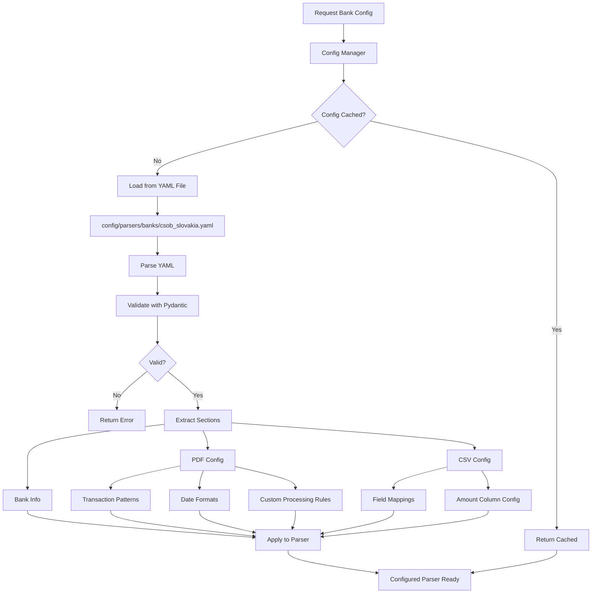
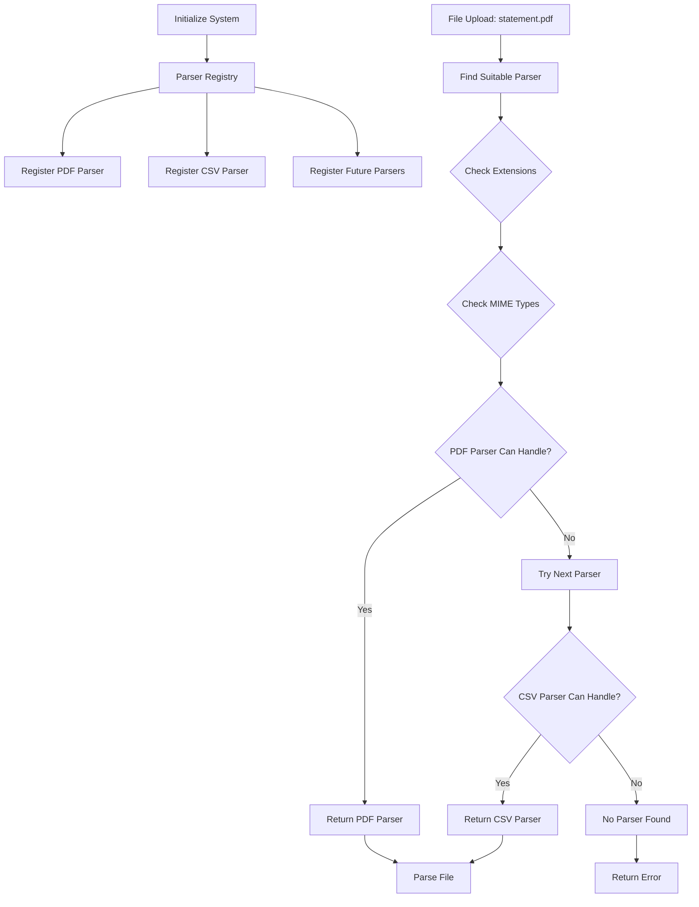
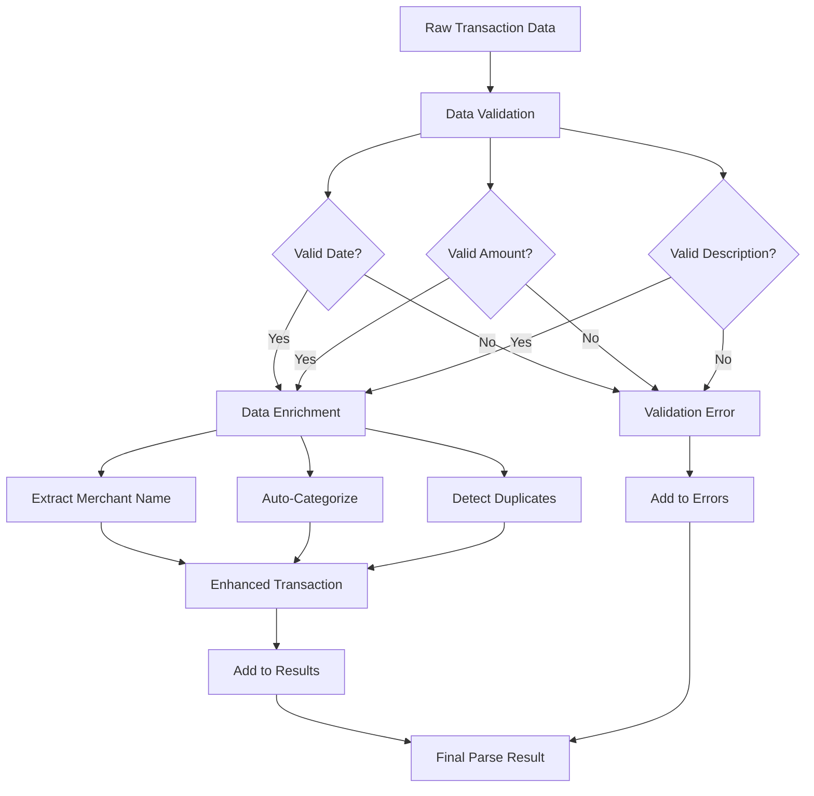
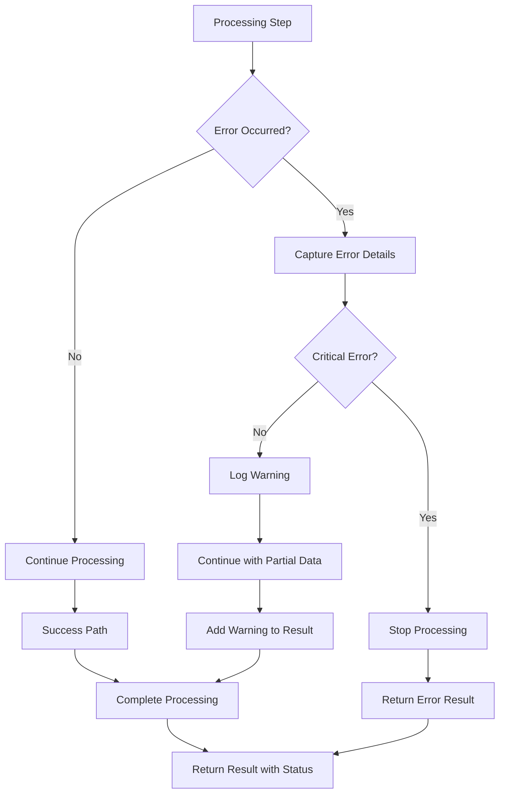
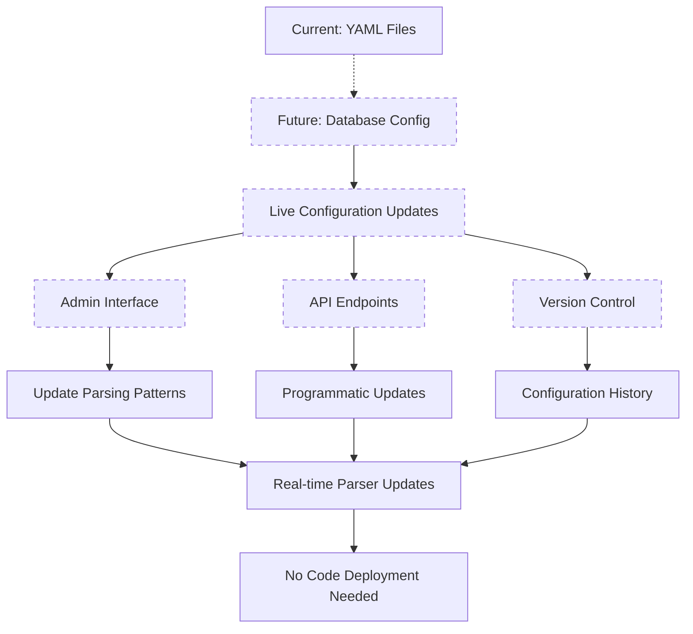

# Parsing Architecture Flow Diagrams

## 1. Complete Parsing Process Overview

```mermaid
flowchart TD
    A["User Uploads File"] --> B["File Detection"]
    B --> C{"File Type?"}
    
    C -->|PDF| D["PDF Parser"]
    C -->|CSV| E["CSV Parser"]
    C -->|Unknown| F["Error: Unsupported"]
    
    D --> G["Load Bank Config"]
    E --> G
    
    G --> H{"Bank Detected?"}
    H -->|ČSOB| I["ČSOB Specific Processing"]
    H -->|Other| J["Generic Processing"]
    
    I --> K["Extract Transactions"]
    J --> K
    
    K --> L["Validate Data"]
    L --> M["Enrich Transactions"]
    M --> N["Return Results"]
```

## 2. ČSOB PDF Processing Detail

```mermaid
flowchart TD
    A["ČSOB PDF Text"] --> B["Line by Line Processing"]
    
    B --> C{"Date Pattern Found?"}
    C -->|No| D["Next Line"]
    C -->|Yes| E["Parse Transaction Components"]
    
    E --> F["Extract Date: 2. 5."]
    E --> G["Extract Description"]
    E --> H["Extract Amount: -12,90"]
    
    F --> I["Convert to 2025-05-02"]
    H --> J["Convert to -12.90"]
    
    E --> K["Look Ahead for Details"]
    K --> L{"Reference Line?"}
    K --> M{"Merchant Line?"}
    K --> N{"Exchange Rate Line?"}
    
    L -->|Yes| O["Extract Reference"]
    M -->|Yes| P["Extract Merchant Info"]
    N -->|Yes| Q["Extract Exchange Rate"]
    
    P --> R["Split Merchant and Location"]
    R --> S["SUPERMARKET FRESH"]
    R --> T["KOSICE"]
    
    Q --> U["Parse Currency: PLN"]
    Q --> V["Parse Rate: 4.2"]
    
    I --> W["Create Transaction Object"]
    J --> W
    S --> W
    T --> W
    O --> W
    U --> W
    V --> W
    
    W --> X["Clean Business Names"]
    X --> Y["Final Transaction"]
    
    D --> B
```

## 3. Configuration System Flow

## 4. Parser Registry System

## 5. Transaction Data Flow

## 6. ČSOB Specific Data Transformations

```mermaid
flowchart LR
    A["Raw ČSOB Data"] --> B["Date: 2. 5."]
    A --> C["Amount: -12,90"]
    A --> D["Merchant: SUPERMARKET FRESH KOSICE"]
    A --> E["Exchange: Suma: 4.83 PLN Kurz: 4,2"]
    
    B --> F["2025-05-02"]
    C --> G["-12.90"]
    D --> H["Merchant: SUPERMARKET FRESH"]
    D --> I["Location: KOSICE"]
    E --> J["Original: 4.83 PLN"]
    E --> K["Rate: 4.2"]
    E --> L["EUR Amount: 1.15"]
    
    F --> M["Final Transaction Object"]
    G --> M
    H --> M
    I --> M
    J --> M
    K --> M
    L --> M
```

## 7. Error Handling Flow

## 8. Future Database Configuration

## Key Components Explained

### 🔍 File Detection
- Checks file extension (.pdf, .csv)
- Validates MIME type
- Detects file encoding
- Validates file size

### 🏛️ Parser Registry
- Maintains list of available parsers
- Matches files to appropriate parsers
- Handles parser initialization
- Supports dynamic parser registration

### 🏦 ČSOB Specific Processing
- **Date Parsing**: "2. 5." → 2025-05-02
- **Amount Parsing**: "-12,90" → -12.90
- **Merchant Splitting**: "SUPERMARKET FRESH KOSICE" → merchant + location
- **Exchange Rates**: "Suma: 4.83 PLN Kurz: 4,2" → multi-currency support
- **Business Cleanup**: Remove S.R.O., A.S. suffixes

### ⚙️ Configuration System
- YAML-based bank configurations
- Pydantic validation
- Caching for performance
- Future database migration ready

### ✅ Data Validation & Enrichment
- Validates required fields
- Extracts merchant names
- Auto-categorizes transactions
- Detects duplicates
- Handles errors gracefully

This architecture is **modular**, **extensible**, and **production-ready**!