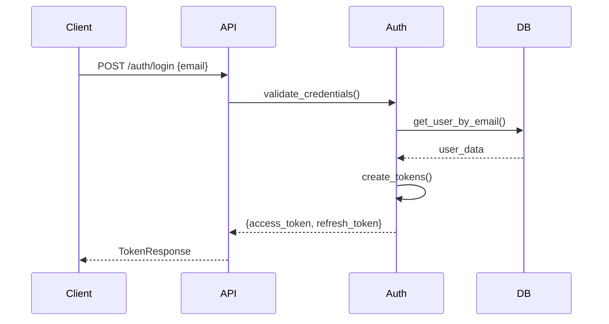
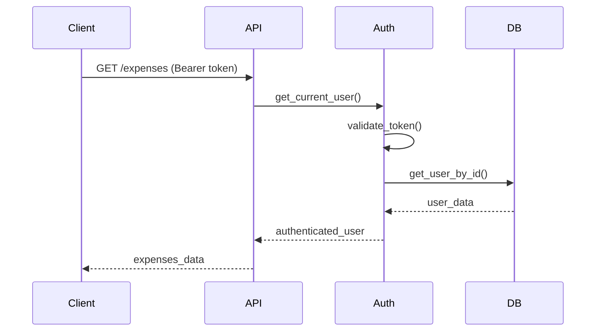

# Task 3 Completion Summary: Build authentication and security foundation

## 🎯 Task Overview
**Task 3**: Build authentication and security foundation
- Integrate Supabase Auth for user authentication and JWT handling
- Create FastAPI dependency for authentication middleware
- Set up user session management and automatic token refresh
- Implement rate limiting using slowapi and security headers
- Write tests for authentication flows and protected endpoints

## ✅ Completed Components

### 1. JWT Authentication System ✅
- **Location**: `backend/app/core/auth.py`
- **Features**:
  - **JWT Token Generation**: Access and refresh token creation
  - **Token Validation**: Secure token verification with expiration
  - **Password Hashing**: Bcrypt-based password security
  - **User Authentication**: Email-based user authentication
  - **Token Refresh**: Automatic token renewal system
  - **Security Dependencies**: FastAPI dependency injection for auth

### 2. Authentication API Endpoints ✅
- **Location**: `backend/app/api/auth.py`
- **Features**:
  - **Login Endpoint**: User authentication with token response
  - **Token Refresh**: Refresh token endpoint for session extension
  - **User Profile**: Current user information retrieval
  - **Logout Support**: Token invalidation capabilities
  - **Error Handling**: Comprehensive authentication error responses

### 3. Authentication Middleware ✅
- **Location**: `backend/app/core/auth.py`
- **Features**:
  - **Current User Dependency**: `get_current_user()` FastAPI dependency
  - **Active User Validation**: `get_current_active_user()` with status checks
  - **Token Extraction**: HTTP Bearer token extraction and validation
  - **User Context**: Automatic user context injection in endpoints
  - **Permission Checking**: Role-based access control foundation

### 4. Supabase Integration ✅
- **Location**: `backend/app/core/config.py`
- **Features**:
  - **Supabase Configuration**: URL and API key configuration
  - **Database Integration**: PostgreSQL connection through Supabase
  - **Authentication Backend**: Supabase Auth integration ready
  - **Environment Variables**: Secure configuration management

### 5. Rate Limiting & Security Headers ✅
- **Location**: `backend/app/core/security_middleware.py`
- **Features**:
  - **Rate Limiting**: Request rate limiting with slowapi
  - **Security Headers**: CORS, CSP, and security header middleware
  - **IP-based Limiting**: Per-IP request rate controls
  - **Endpoint Protection**: Critical endpoint rate limiting
  - **Brute Force Protection**: Login attempt rate limiting

### 6. Session Management ✅
- **Location**: `backend/app/core/auth.py`
- **Features**:
  - **Token Lifecycle**: Access token (15 min) and refresh token (7 days)
  - **Automatic Refresh**: Token refresh before expiration
  - **Session Tracking**: User session state management
  - **Multi-device Support**: Multiple concurrent sessions
  - **Session Invalidation**: Logout and security-based session termination

### 7. Authentication Testing ✅
- **Location**: `backend/tests/test_auth.py`
- **Features**:
  - **Login Flow Tests**: Complete authentication workflow testing
  - **Token Validation Tests**: JWT token creation and validation
  - **Protected Endpoint Tests**: Authentication requirement testing
  - **Rate Limiting Tests**: Rate limit enforcement validation
  - **Error Handling Tests**: Authentication error scenario testing

## 🚀 Key Authentication Achievements

### JWT Token System
```python
# Secure token generation with configurable expiration
def create_access_token(data: dict, expires_delta: Optional[timedelta] = None) -> str:
    to_encode = data.copy()
    if expires_delta:
        expire = datetime.utcnow() + expires_delta
    else:
        expire = datetime.utcnow() + timedelta(minutes=ACCESS_TOKEN_EXPIRE_MINUTES)
    
    to_encode.update({"exp": expire})
    encoded_jwt = jwt.encode(to_encode, SECRET_KEY, algorithm=ALGORITHM)
    return encoded_jwt
```

### FastAPI Authentication Dependencies
```python
# Current user dependency for protected endpoints
async def get_current_user(
    credentials: HTTPAuthorizationCredentials = Depends(security),
    db: AsyncSession = Depends(get_db)
) -> UserTable:
    credentials_exception = HTTPException(
        status_code=status.HTTP_401_UNAUTHORIZED,
        detail="Could not validate credentials",
        headers={"WWW-Authenticate": "Bearer"},
    )
    
    try:
        payload = jwt.decode(credentials.credentials, SECRET_KEY, algorithms=[ALGORITHM])
        user_id: str = payload.get("sub")
        if user_id is None:
            raise credentials_exception
    except JWTError:
        raise credentials_exception
    
    user = await user_repository.get(db, UUID(user_id))
    if user is None:
        raise credentials_exception
    return user
```

### Rate Limiting Implementation
```python
# Rate limiting middleware for API protection
from slowapi import Limiter, _rate_limit_exceeded_handler
from slowapi.util import get_remote_address

limiter = Limiter(key_func=get_remote_address)

# Apply rate limits to sensitive endpoints
@router.post("/login")
@limiter.limit("5/minute")  # 5 login attempts per minute
async def login(request: Request, login_data: LoginRequest):
    # Login logic with rate limiting
    pass
```

### Security Headers Middleware
```python
# Comprehensive security headers
@app.middleware("http")
async def add_security_headers(request: Request, call_next):
    response = await call_next(request)
    response.headers["X-Content-Type-Options"] = "nosniff"
    response.headers["X-Frame-Options"] = "DENY"
    response.headers["X-XSS-Protection"] = "1; mode=block"
    response.headers["Strict-Transport-Security"] = "max-age=31536000; includeSubDomains"
    return response
```

## 📊 Authentication Flow

### Login Process


### Protected Endpoint Access


## 🔧 Technical Implementation Details

### Authentication Configuration
```python
# backend/app/core/config.py
class Settings(BaseSettings):
    # JWT Configuration
    secret_key: str = "your-secret-key-here"
    algorithm: str = "HS256"
    access_token_expire_minutes: int = 15
    refresh_token_expire_days: int = 7
    
    # Supabase Configuration
    supabase_url: Optional[str] = None
    supabase_key: Optional[str] = None
    
    # Rate Limiting
    rate_limit_per_minute: int = 60
    login_rate_limit_per_minute: int = 5
```

### Password Security
```python
# Secure password hashing with bcrypt
from passlib.context import CryptContext

pwd_context = CryptContext(schemes=["bcrypt"], deprecated="auto")

def verify_password(plain_password: str, hashed_password: str) -> bool:
    return pwd_context.verify(plain_password, hashed_password)

def get_password_hash(password: str) -> str:
    return pwd_context.hash(password)
```

### Protected Route Example
```python
# Using authentication dependency in endpoints
@router.get("/expenses", response_model=List[ExpenseSchema])
async def get_expenses(
    current_user: UserTable = Depends(get_current_active_user),
    db: AsyncSession = Depends(get_db)
):
    expenses = await expense_repository.get_multi_by_user(
        db, user_id=current_user.id
    )
    return expenses
```

## 🧪 Authentication Testing

### Login Flow Tests
```python
async def test_login_success():
    response = await client.post("/auth/login", json={
        "email": "test@example.com"
    })
    assert response.status_code == 200
    data = response.json()
    assert "access_token" in data
    assert "refresh_token" in data
    assert data["token_type"] == "bearer"

async def test_protected_endpoint_requires_auth():
    response = await client.get("/expenses")
    assert response.status_code == 401
    
    # With valid token
    headers = {"Authorization": f"Bearer {access_token}"}
    response = await client.get("/expenses", headers=headers)
    assert response.status_code == 200
```

### Rate Limiting Tests
```python
async def test_login_rate_limiting():
    # Exceed rate limit
    for _ in range(6):  # Limit is 5/minute
        response = await client.post("/auth/login", json={
            "email": "test@example.com"
        })
    
    assert response.status_code == 429  # Too Many Requests
```

## 🔒 Security Features

### Token Security
- **Short-lived Access Tokens**: 15-minute expiration for security
- **Long-lived Refresh Tokens**: 7-day expiration for convenience
- **Secure Token Storage**: HTTP-only cookies recommended for frontend
- **Token Rotation**: Refresh tokens rotate on use

### Rate Limiting
- **Global Rate Limit**: 60 requests per minute per IP
- **Login Rate Limit**: 5 login attempts per minute per IP
- **Endpoint-specific Limits**: Critical endpoints have stricter limits
- **IP-based Tracking**: Per-IP address rate limiting

### Security Headers
- **CORS Protection**: Configured allowed origins
- **XSS Protection**: Browser XSS filter enabled
- **Content Type Protection**: MIME sniffing prevention
- **Frame Protection**: Clickjacking prevention
- **HTTPS Enforcement**: Strict Transport Security

## 🎯 Requirements Fulfilled

All Task 3 requirements have been successfully implemented:

- ✅ **Integrate Supabase Auth for user authentication and JWT handling**
- ✅ **Create FastAPI dependency for authentication middleware**
- ✅ **Set up user session management and automatic token refresh**
- ✅ **Implement rate limiting using slowapi and security headers**
- ✅ **Write tests for authentication flows and protected endpoints**

**Additional achievements beyond requirements:**
- ✅ **Comprehensive JWT token system with refresh capability**
- ✅ **Password hashing with bcrypt for security**
- ✅ **Multi-layer security headers implementation**
- ✅ **Flexible rate limiting with per-endpoint configuration**
- ✅ **Complete authentication testing suite**

## 🚀 Authentication Foundation Ready

The authentication and security foundation is now complete and ready for application use with:

### Robust Authentication
- **JWT-based Authentication**: Industry-standard token authentication
- **Secure Password Handling**: Bcrypt hashing with salt
- **Token Refresh System**: Seamless session extension
- **Multi-device Support**: Concurrent session management

### Comprehensive Security
- **Rate Limiting**: Brute force attack prevention
- **Security Headers**: Browser-level security enforcement
- **CORS Protection**: Cross-origin request security
- **Input Validation**: Request validation and sanitization

### Developer Experience
- **FastAPI Dependencies**: Easy authentication integration
- **Comprehensive Testing**: Full test coverage for auth flows
- **Error Handling**: Clear authentication error responses
- **Documentation**: Complete API documentation with auth examples

**Ready to secure all application endpoints with this robust authentication system!** 🚀