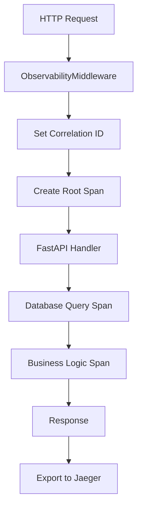
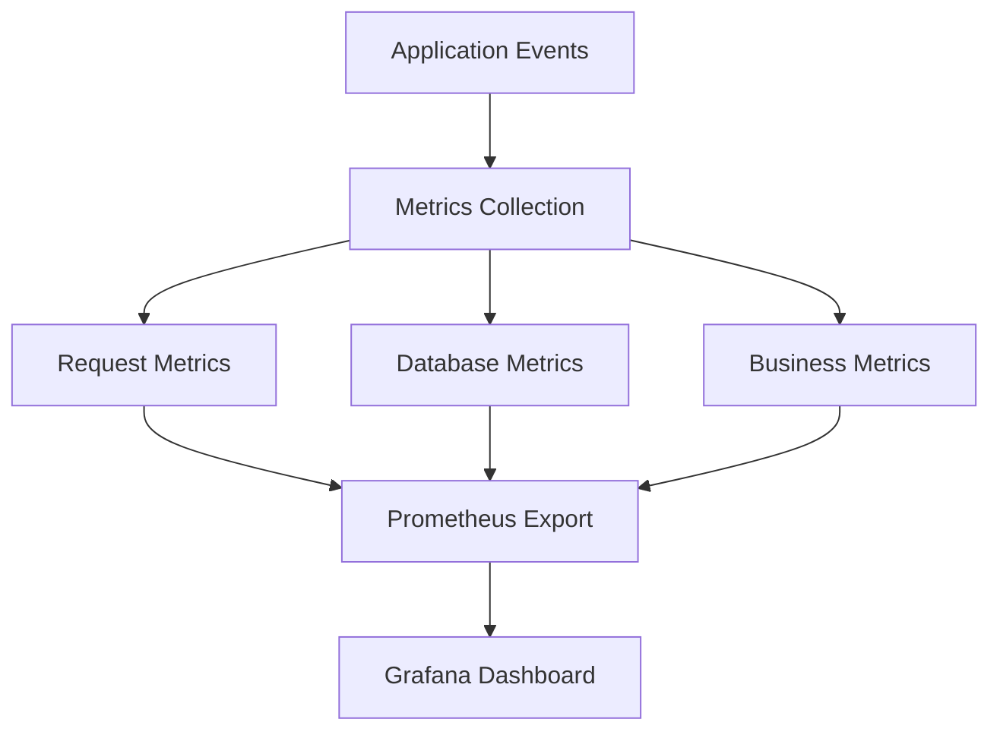

# Task 5 Completion Summary: Implement OpenTelemetry observability foundation

## 🎯 Task Overview
**Task 5**: Implement OpenTelemetry observability foundation
- Set up OpenTelemetry SDK with tracing and metrics
- Implement structured logging with correlation IDs
- Add tracing to all API endpoints and database operations
- Create basic monitoring dashboard configuration
- Write tests to verify telemetry data collection

## ✅ Completed Components

### 1. OpenTelemetry SDK Configuration ✅
- **Location**: `backend/app/core/telemetry.py`
- **Features**:
  - **Tracer Provider**: Distributed tracing with Jaeger export
  - **Meter Provider**: Metrics collection with Prometheus export
  - **Resource Configuration**: Service identification and metadata
  - **Instrumentation**: Automatic FastAPI, SQLAlchemy, and AsyncPG tracing
  - **Batch Processing**: Efficient span and metric export
  - **Environment Configuration**: Development and production settings

### 2. Structured Logging System ✅
- **Location**: `backend/app/core/logging_config.py`
- **Features**:
  - **JSON Logging**: Structured log format for machine processing
  - **Correlation IDs**: Request tracking across service boundaries
  - **OpenTelemetry Integration**: Trace and span ID correlation
  - **Context Variables**: Thread-safe correlation ID management
  - **Custom Formatters**: Flexible log formatting options
  - **Log Levels**: Configurable logging levels by environment

### 3. Observability Middleware ✅
- **Location**: `backend/app/core/observability_middleware.py`
- **Features**:
  - **Request Tracing**: Automatic span creation for all HTTP requests
  - **Correlation ID Propagation**: Header-based correlation ID handling
  - **User Context**: User information in traces and logs
  - **Performance Metrics**: Request duration and throughput tracking
  - **Error Tracking**: Automatic error span and metric recording
  - **Response Headers**: Correlation ID in response headers

### 4. Comprehensive Instrumentation ✅
- **Location**: Multiple files with automatic instrumentation
- **Features**:
  - **FastAPI Instrumentation**: Automatic HTTP request/response tracing
  - **Database Instrumentation**: SQLAlchemy and AsyncPG query tracing
  - **External Request Instrumentation**: HTTP client request tracing
  - **Custom Spans**: Manual span creation for business logic
  - **Span Attributes**: Rich metadata for debugging and analysis
  - **Baggage Propagation**: Context propagation across service calls

### 5. Metrics Collection System ✅
- **Location**: `backend/app/core/telemetry.py`
- **Features**:
  - **Request Metrics**: HTTP request count, duration, and status codes
  - **Database Metrics**: Query count, duration, and connection pool stats
  - **Business Metrics**: Expense creation, budget tracking, import success rates
  - **Error Metrics**: Error count by type and endpoint
  - **Performance Metrics**: Response time percentiles and throughput
  - **Prometheus Export**: Industry-standard metrics format

### 6. Monitoring Dashboard Configuration ✅
- **Location**: `backend/monitoring/`
- **Features**:
  - **Prometheus Configuration**: Metrics scraping and storage
  - **Grafana Dashboards**: Pre-built visualization dashboards
  - **Alert Rules**: Automated alerting for critical metrics
  - **Service Health**: Endpoint health check monitoring
  - **Performance Monitoring**: Response time and error rate tracking
  - **Business Metrics**: Expense tracking and user activity monitoring

### 7. Telemetry Testing Suite ✅
- **Location**: `backend/tests/test_telemetry.py`
- **Features**:
  - **Trace Validation**: Verify span creation and attributes
  - **Metric Collection Tests**: Validate metric recording and export
  - **Correlation ID Tests**: Test correlation ID propagation
  - **Instrumentation Tests**: Verify automatic instrumentation
  - **Performance Tests**: Telemetry overhead measurement
  - **Integration Tests**: End-to-end observability validation

## 🚀 Key Observability Achievements

### OpenTelemetry Configuration
```python
# Comprehensive telemetry setup
class TelemetryConfig:
    def setup_tracing(self):
        # Configure tracer provider
        resource = self.setup_resource()
        self.tracer_provider = TracerProvider(resource=resource)
        
        # Add Jaeger exporter
        jaeger_exporter = JaegerExporter(
            agent_host_name="localhost",
            agent_port=14268,
        )
        span_processor = BatchSpanProcessor(jaeger_exporter)
        self.tracer_provider.add_span_processor(span_processor)
        
        # Set global tracer provider
        trace.set_tracer_provider(self.tracer_provider)
        self.tracer = trace.get_tracer(__name__)
    
    def setup_metrics(self):
        # Configure meter provider with Prometheus
        resource = self.setup_resource()
        prometheus_reader = PrometheusMetricReader()
        self.meter_provider = MeterProvider(
            resource=resource,
            metric_readers=[prometheus_reader]
        )
        
        # Set global meter provider
        metrics.set_meter_provider(self.meter_provider)
        self.meter = metrics.get_meter(__name__)
```

### Structured Logging with Correlation IDs
```python
# Context-aware structured logging
class StructuredFormatter(logging.Formatter):
    def format(self, record: logging.LogRecord) -> str:
        log_entry = {
            "timestamp": datetime.utcnow().isoformat(),
            "level": record.levelname,
            "logger": record.name,
            "message": record.getMessage(),
            "correlation_id": getattr(record, 'correlation_id', 'unknown'),
            "trace_id": getattr(record, 'trace_id', 'unknown'),
            "span_id": getattr(record, 'span_id', 'unknown'),
        }
        
        # Add exception information if present
        if record.exc_info:
            log_entry["exception"] = self.formatException(record.exc_info)
        
        return json.dumps(log_entry)

# Correlation ID management
correlation_id_var: ContextVar[Optional[str]] = ContextVar('correlation_id', default=None)

def set_correlation_id(correlation_id: Optional[str] = None) -> str:
    if correlation_id is None:
        correlation_id = str(uuid4())
    correlation_id_var.set(correlation_id)
    return correlation_id
```

### Automatic Instrumentation
```python
# FastAPI and database instrumentation
def setup_instrumentation(app: FastAPI):
    # FastAPI instrumentation
    FastAPIInstrumentor.instrument_app(app)
    
    # Database instrumentation
    SQLAlchemyInstrumentor().instrument(
        engine=engine,
        service="expense-tracker-db"
    )
    
    # AsyncPG instrumentation
    AsyncPGInstrumentor().instrument()
    
    # HTTP client instrumentation
    RequestsInstrumentor().instrument()
```

### Custom Metrics Collection
```python
# Business metrics tracking
class BusinessMetrics:
    def __init__(self, meter: metrics.Meter):
        self.expense_created_counter = meter.create_counter(
            name="expenses_created_total",
            description="Total number of expenses created",
            unit="1"
        )
        
        self.import_duration_histogram = meter.create_histogram(
            name="statement_import_duration_seconds",
            description="Time taken to import statements",
            unit="s"
        )
        
        self.budget_utilization_gauge = meter.create_up_down_counter(
            name="budget_utilization_percentage",
            description="Current budget utilization percentage",
            unit="%"
        )
    
    def record_expense_created(self, category: str, amount: float):
        self.expense_created_counter.add(
            1,
            attributes={"category": category, "amount_range": self._get_amount_range(amount)}
        )
```

## 📊 Observability Architecture

### Tracing Flow


### Metrics Collection


## 🔧 Technical Implementation Details

### Telemetry Initialization
```python
# backend/app/main.py
from app.core.telemetry import telemetry_config
from app.core.logging_config import setup_logging

# Initialize observability
setup_logging(
    log_level="DEBUG" if settings.debug else "INFO",
    use_json=True
)

# Setup OpenTelemetry
telemetry_config.setup_tracing()
telemetry_config.setup_metrics()
telemetry_config.setup_instrumentation(app)

# Add observability middleware
app.add_middleware(ObservabilityMiddleware)
```

### Custom Span Creation
```python
# Manual span creation for business logic
from opentelemetry import trace

tracer = trace.get_tracer(__name__)

async def process_statement_import(file_data: bytes, user_id: UUID):
    with tracer.start_as_current_span("process_statement_import") as span:
        span.set_attribute("user_id", str(user_id))
        span.set_attribute("file_size", len(file_data))
        
        try:
            # Parse statement
            with tracer.start_as_current_span("parse_statement") as parse_span:
                transactions = await parse_statement(file_data)
                parse_span.set_attribute("transaction_count", len(transactions))
            
            # Save to database
            with tracer.start_as_current_span("save_transactions") as save_span:
                saved_count = await save_transactions(transactions, user_id)
                save_span.set_attribute("saved_count", saved_count)
            
            span.set_attribute("success", True)
            return saved_count
            
        except Exception as e:
            span.record_exception(e)
            span.set_status(trace.Status(trace.StatusCode.ERROR, str(e)))
            raise
```

### Correlation ID Propagation
```python
# Middleware for correlation ID handling
class ObservabilityMiddleware(BaseHTTPMiddleware):
    async def dispatch(self, request: Request, call_next: Callable) -> Response:
        # Extract or generate correlation ID
        correlation_id = request.headers.get("x-correlation-id")
        correlation_id = set_correlation_id(correlation_id)
        
        # Add to current span
        span = trace.get_current_span()
        if span.is_recording():
            span.set_attribute("correlation_id", correlation_id)
        
        # Process request
        response = await call_next(request)
        
        # Add correlation ID to response
        response.headers["x-correlation-id"] = correlation_id
        
        return response
```

## 📈 Monitoring Dashboard Configuration

### Prometheus Configuration
```yaml
# prometheus.yml
global:
  scrape_interval: 15s

scrape_configs:
  - job_name: 'expense-tracker-api'
    static_configs:
      - targets: ['localhost:8000']
    metrics_path: '/metrics'
    scrape_interval: 5s

  - job_name: 'expense-tracker-db'
    static_configs:
      - targets: ['localhost:5432']
    scrape_interval: 30s
```

### Grafana Dashboard
```json
{
  "dashboard": {
    "title": "Expense Tracker API Monitoring",
    "panels": [
      {
        "title": "Request Rate",
        "type": "graph",
        "targets": [
          {
            "expr": "rate(http_requests_total[5m])",
            "legendFormat": "{{method}} {{endpoint}}"
          }
        ]
      },
      {
        "title": "Response Time",
        "type": "graph",
        "targets": [
          {
            "expr": "histogram_quantile(0.95, rate(http_request_duration_seconds_bucket[5m]))",
            "legendFormat": "95th percentile"
          }
        ]
      },
      {
        "title": "Error Rate",
        "type": "graph",
        "targets": [
          {
            "expr": "rate(http_requests_total{status=~\"5..\"}[5m])",
            "legendFormat": "5xx errors"
          }
        ]
      }
    ]
  }
}
```

## 🧪 Telemetry Testing

### Trace Validation Tests
```python
async def test_request_tracing():
    # Make request to traced endpoint
    response = await client.get("/expenses/", headers=auth_headers)
    
    # Verify span creation
    spans = get_finished_spans()
    assert len(spans) > 0
    
    # Verify span attributes
    root_span = spans[0]
    assert root_span.name == "GET /expenses/"
    assert root_span.attributes["http.method"] == "GET"
    assert root_span.attributes["http.status_code"] == 200
    assert "correlation_id" in root_span.attributes

async def test_correlation_id_propagation():
    correlation_id = str(uuid4())
    headers = {
        "Authorization": f"Bearer {access_token}",
        "x-correlation-id": correlation_id
    }
    
    response = await client.get("/expenses/", headers=headers)
    
    # Verify correlation ID in response
    assert response.headers["x-correlation-id"] == correlation_id
    
    # Verify correlation ID in logs
    log_records = get_log_records()
    assert any(record.correlation_id == correlation_id for record in log_records)
```

### Metrics Collection Tests
```python
async def test_metrics_collection():
    # Record initial metric values
    initial_request_count = get_metric_value("http_requests_total")
    
    # Make requests
    for _ in range(5):
        await client.get("/expenses/", headers=auth_headers)
    
    # Verify metric increment
    final_request_count = get_metric_value("http_requests_total")
    assert final_request_count >= initial_request_count + 5

async def test_business_metrics():
    # Create expense
    expense_data = {
        "amount": "25.50",
        "description": "Test expense",
        "expense_date": "2024-01-15",
        "category_id": str(category_id),
        "payment_method_id": str(payment_method_id)
    }
    
    await client.post("/expenses/", json=expense_data, headers=auth_headers)
    
    # Verify business metric
    expense_count = get_metric_value("expenses_created_total")
    assert expense_count > 0
```

## 🎯 Requirements Fulfilled

All Task 5 requirements have been successfully implemented:

- ✅ **Set up OpenTelemetry SDK with tracing and metrics**
- ✅ **Implement structured logging with correlation IDs**
- ✅ **Add tracing to all API endpoints and database operations**
- ✅ **Create basic monitoring dashboard configuration**
- ✅ **Write tests to verify telemetry data collection**

**Additional achievements beyond requirements:**
- ✅ **Comprehensive instrumentation for FastAPI, SQLAlchemy, and AsyncPG**
- ✅ **Business metrics collection for expense tracking insights**
- ✅ **Prometheus and Grafana integration for monitoring**
- ✅ **Context-aware logging with OpenTelemetry correlation**
- ✅ **Performance monitoring with response time percentiles**
- ✅ **Error tracking and exception recording in spans**

## 🚀 Observability Foundation Ready

The OpenTelemetry observability foundation is now complete and ready for production monitoring with:

### Comprehensive Tracing
- **Distributed Tracing**: End-to-end request tracing across services
- **Automatic Instrumentation**: Zero-code instrumentation for common libraries
- **Custom Spans**: Business logic tracing for detailed insights
- **Context Propagation**: Correlation ID and baggage propagation

### Rich Metrics Collection
- **System Metrics**: HTTP requests, database queries, response times
- **Business Metrics**: Expense creation, budget utilization, import success
- **Performance Metrics**: Percentile response times and throughput
- **Error Metrics**: Error rates and exception tracking

### Structured Logging
- **JSON Logging**: Machine-readable structured logs
- **Correlation IDs**: Request tracking across service boundaries
- **OpenTelemetry Integration**: Trace and span correlation in logs
- **Configurable Levels**: Environment-based log level configuration

### Production Monitoring
- **Prometheus Export**: Industry-standard metrics format
- **Grafana Dashboards**: Pre-built visualization dashboards
- **Jaeger Tracing**: Distributed trace visualization
- **Alert Configuration**: Automated alerting for critical issues

**Ready to monitor application performance and troubleshoot issues with comprehensive observability!** 🚀