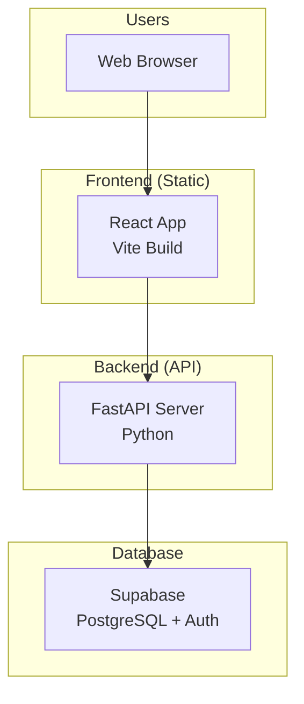

# Deployment Guide

Your Expense Tracker application is ready for deployment! The separate backend (FastAPI) and frontend (React) architecture is ideal for modern deployment strategies.

## Architecture Overview



## Deployment Options

### Option 1: 100% FREE - Netlify + Render + Supabase ⭐

**Best for**: Personal projects, learning, zero cost
**Total Cost**: $0/month forever

- **Frontend**: Netlify (100GB bandwidth/month)
- **Backend**: Render (750 hours/month - enough for 24/7)
- **Database**: Supabase (500MB storage, 50K users)

See [FREE_DEPLOYMENT.md](FREE_DEPLOYMENT.md) for detailed free deployment guide.

### Option 2: Vercel + Railway (Premium)

**Best for**: Production apps, guaranteed uptime, more resources

#### Frontend (Vercel)
```bash
# 1. Install Vercel CLI
npm i -g vercel

# 2. Deploy frontend
cd frontend
vercel --prod
```

#### Backend (Railway)
```bash
# 1. Install Railway CLI
npm install -g @railway/cli

# 2. Login and deploy
railway login
cd backend
railway deploy
```

**Pros**: Easy setup, automatic HTTPS, great performance
**Cons**: Railway has usage limits on free tier

---

### Option 2: Netlify + Render

**Best for**: Free tier with good limits, simple setup

#### Frontend (Netlify)
1. Connect your GitHub repo to Netlify
2. Build settings:
   - Build command: `cd frontend && npm run build`
   - Publish directory: `frontend/dist`

#### Backend (Render)
1. Connect your GitHub repo to Render
2. Create a Web Service:
   - Build command: `cd backend && pip install -r requirements.txt`
   - Start command: `cd backend && uvicorn app.main:app --host 0.0.0.0 --port $PORT`

---

### Option 3: Docker + DigitalOcean/AWS

**Best for**: Full control, production-grade deployment

#### Create Docker Files

**Backend Dockerfile:**
```dockerfile
FROM python:3.11-slim

WORKDIR /app

COPY backend/requirements.txt .
RUN pip install --no-cache-dir -r requirements.txt

COPY backend/ .

EXPOSE 8000

CMD ["uvicorn", "app.main:app", "--host", "0.0.0.0", "--port", "8000"]
```

**Frontend Dockerfile:**
```dockerfile
FROM node:18-alpine as build

WORKDIR /app
COPY frontend/package*.json ./
RUN npm ci

COPY frontend/ .
RUN npm run build

FROM nginx:alpine
COPY --from=build /app/dist /usr/share/nginx/html
COPY frontend/nginx.conf /etc/nginx/conf.d/default.conf

EXPOSE 80
```

**Docker Compose:**
```yaml
version: '3.8'
services:
  backend:
    build:
      context: .
      dockerfile: backend/Dockerfile
    ports:
      - "8000:8000"
    environment:
      - SUPABASE_URL=${SUPABASE_URL}
      - SUPABASE_KEY=${SUPABASE_KEY}
      - SECRET_KEY=${SECRET_KEY}
  
  frontend:
    build:
      context: .
      dockerfile: frontend/Dockerfile
    ports:
      - "80:80"
    depends_on:
      - backend
```

---

## Pre-Deployment Checklist

### Backend Preparation

1. **Environment Variables**
   ```bash
   # Create production .env
   SUPABASE_URL=https://your-project.supabase.co
   SUPABASE_KEY=your-production-anon-key
   SECRET_KEY=your-secure-production-secret
   DEBUG=false
   ```

2. **Update CORS Origins**
   ```python
   # In backend/app/main.py
   app.add_middleware(
       CORSMiddleware,
       allow_origins=[
           "https://your-frontend-domain.com",
           "http://localhost:3000",  # Keep for development
           "http://localhost:5173"   # Keep for development
       ],
       allow_credentials=True,
       allow_methods=["*"],
       allow_headers=["*"],
   )
   ```

3. **Requirements File**
   ```bash
   cd backend
   pip freeze > requirements.txt
   ```

### Frontend Preparation

1. **Environment Variables**
   ```bash
   # Create frontend/.env.production
   VITE_API_URL=https://your-backend-domain.com/api/v1
   ```

2. **Build Configuration**
   ```typescript
   // Update frontend/src/lib/api.ts if needed
   const API_BASE_URL = import.meta.env.VITE_API_URL || 'http://localhost:8000/api/v1'
   ```

---

## Step-by-Step Deployment (Vercel + Railway)

### 1. Prepare Your Code

```bash
# 1. Update backend CORS
# Edit backend/app/main.py - add your future frontend domain

# 2. Create production requirements
cd backend
pip freeze > requirements.txt

# 3. Create frontend environment file
cd ../frontend
echo "VITE_API_URL=https://your-backend.railway.app/api/v1" > .env.production
```

### 2. Deploy Backend (Railway)

```bash
# 1. Install Railway CLI
npm install -g @railway/cli

# 2. Login to Railway
railway login

# 3. Create new project
cd backend
railway init

# 4. Add environment variables
railway variables set SUPABASE_URL=https://your-project.supabase.co
railway variables set SUPABASE_KEY=your-anon-key
railway variables set SECRET_KEY=your-secure-secret
railway variables set DEBUG=false

# 5. Deploy
railway up
```

### 3. Deploy Frontend (Vercel)

```bash
# 1. Install Vercel CLI
npm i -g vercel

# 2. Deploy
cd frontend
vercel --prod

# 3. Set environment variables in Vercel dashboard
# VITE_API_URL=https://your-backend.railway.app/api/v1
```

### 4. Update Backend CORS

```python
# Update backend/app/main.py with your actual frontend URL
allow_origins=[
    "https://your-app.vercel.app",  # Your actual Vercel URL
    "http://localhost:3000",
    "http://localhost:5173"
]
```

### 5. Redeploy Backend

```bash
cd backend
railway up
```

---

## Production Considerations

### Security

1. **Environment Variables**: Never commit production secrets
2. **HTTPS Only**: Ensure both frontend and backend use HTTPS
3. **CORS**: Restrict to your actual domains
4. **Rate Limiting**: Consider adding rate limiting middleware

### Performance

1. **Frontend**: Enable gzip compression, CDN
2. **Backend**: Consider adding Redis for caching
3. **Database**: Supabase handles this automatically

### Monitoring

1. **Logs**: Both Vercel and Railway provide log viewing
2. **Uptime**: Consider services like UptimeRobot
3. **Errors**: Consider Sentry for error tracking

---

## Cost Estimates

### Free Tier Limits

**Vercel (Frontend)**:
- 100GB bandwidth/month
- Unlimited static deployments
- Custom domains included

**Railway (Backend)**:
- $5/month after free trial
- 500 hours/month execution time
- 1GB RAM, 1 vCPU

**Supabase (Database)**:
- 500MB database storage
- 2GB bandwidth/month
- 50,000 monthly active users

### Paid Tiers (if needed)

**Vercel Pro**: $20/month
**Railway Pro**: $20/month  
**Supabase Pro**: $25/month

---

## Deployment Scripts

Create these helper scripts:

**deploy-backend.sh:**
```bash
#!/bin/bash
cd backend
pip freeze > requirements.txt
railway up
echo "Backend deployed to Railway!"
```

**deploy-frontend.sh:**
```bash
#!/bin/bash
cd frontend
npm run build
vercel --prod
echo "Frontend deployed to Vercel!"
```

**deploy-all.sh:**
```bash
#!/bin/bash
echo "Deploying Expense Tracker..."
./deploy-backend.sh
./deploy-frontend.sh
echo "Deployment complete!"
```

---

## Troubleshooting

### Common Issues

1. **CORS Errors**: Update backend CORS origins
2. **API Not Found**: Check VITE_API_URL in frontend
3. **Build Failures**: Ensure all dependencies in requirements.txt
4. **Environment Variables**: Double-check all env vars are set

### Debug Commands

```bash
# Check backend logs
railway logs

# Check frontend build
cd frontend && npm run build

# Test API locally
curl https://your-backend.railway.app/health
```

---

## Next Steps After Deployment

1. **Custom Domain**: Add your own domain to both services
2. **SSL Certificate**: Automatic with Vercel/Railway
3. **Monitoring**: Set up uptime monitoring
4. **Backups**: Supabase handles database backups
5. **CI/CD**: Set up automatic deployments on git push

Your expense tracker is now production-ready! 🚀