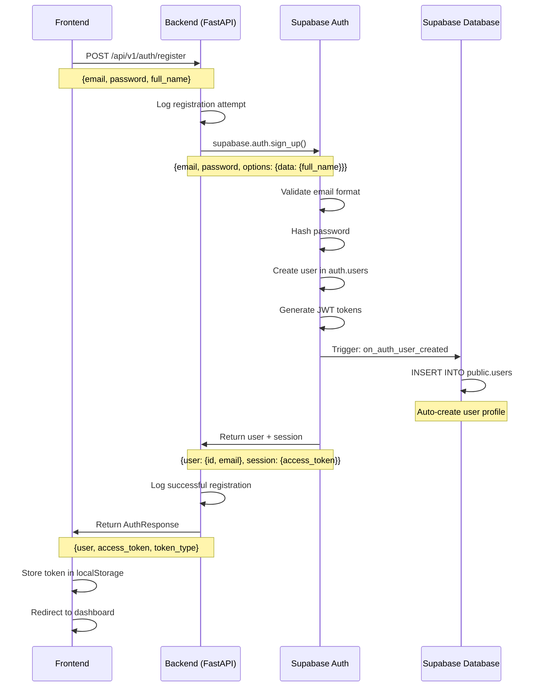
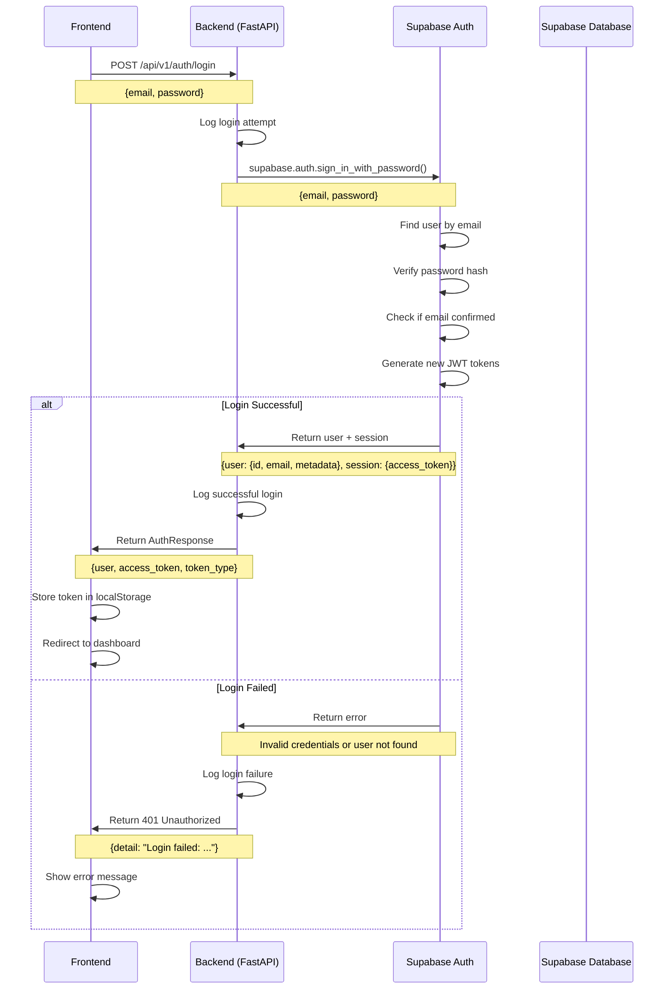
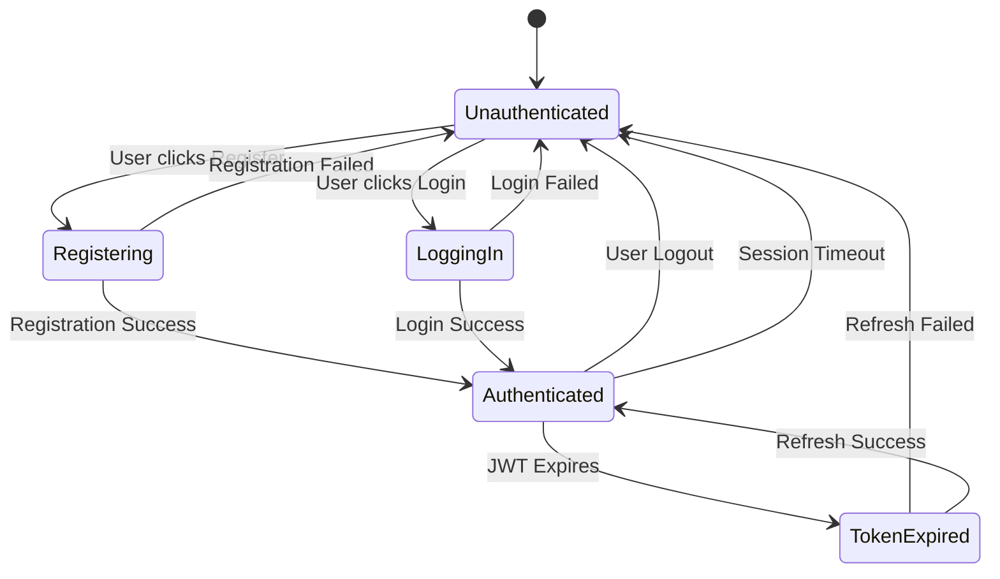
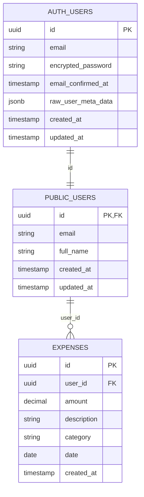

# Supabase Authentication Guide

This document explains how user registration and login work in the Expense Tracker application using Supabase Auth.

## Overview

Supabase provides a complete authentication system that handles user registration, login, JWT tokens, and session management. Our FastAPI backend acts as a proxy between the frontend and Supabase Auth services.

## Architecture Components

- **Frontend**: React application (running on localhost:5173)
- **Backend**: FastAPI application (running on localhost:8000)
- **Supabase Auth**: Authentication service
- **Supabase Database**: PostgreSQL database with user profiles

## Registration Flow



### Registration Process Details

1. **Frontend Submission**: User fills registration form and submits
2. **Backend Validation**: FastAPI receives and logs the request
3. **Supabase Auth Call**: Backend calls `supabase.auth.sign_up()`
4. **Email Validation**: Supabase validates email format (rejects fake domains)
5. **User Creation**: Supabase creates user in `auth.users` table
6. **Profile Creation**: Database trigger automatically creates profile in `public.users`
7. **Token Generation**: Supabase generates JWT access and refresh tokens
8. **Response**: Backend returns user info and tokens to frontend

## Login Flow



### Login Process Details

1. **Frontend Submission**: User enters email/password and submits
2. **Backend Validation**: FastAPI receives and logs the login attempt
3. **Supabase Auth Call**: Backend calls `supabase.auth.sign_in_with_password()`
4. **User Lookup**: Supabase finds user by email in `auth.users`
5. **Password Verification**: Supabase verifies password against stored hash
6. **Email Confirmation Check**: Supabase checks if email is confirmed (if required)
7. **Token Generation**: If valid, generates new JWT tokens
8. **Response**: Backend returns user info and tokens, or error message

## Authentication State Management



## Database Schema



## JWT Token Structure

When a user successfully authenticates, Supabase returns a JWT token with this structure:

```json
{
  "aud": "authenticated",
  "exp": 1738234567,
  "iat": 1738230967,
  "iss": "https://nsvdbcqvyphyiktrvtkw.supabase.co/auth/v1",
  "sub": "45fe1132-9720-4fb3-835b-912bc8b195dd",
  "email": "testuser@gmail.com",
  "phone": "",
  "app_metadata": {
    "provider": "email",
    "providers": ["email"]
  },
  "user_metadata": {
    "full_name": "Test User"
  },
  "role": "authenticated"
}
```

## Row Level Security (RLS)

Our database uses RLS policies to ensure users can only access their own data:

```sql
-- Users can only see their own profile
CREATE POLICY "Users can view own profile" ON public.users
    FOR SELECT USING (auth.uid() = id);

-- Users can only see their own expenses
CREATE POLICY "Users can view own expenses" ON public.expenses
    FOR SELECT USING (auth.uid() = user_id);
```

## Common Issues and Solutions

### 1. Registration Fails with "Invalid Email"

**Problem**: Supabase rejects certain email formats

```
Registration failed: Email address "test@example.com" is invalid
```

**Solution**: Use realistic email domains

- ✅ Good: `user@gmail.com`, `test@outlook.com`
- ❌ Bad: `test@example.com`, `user@test.com`

### 2. CORS Errors

**Problem**: Frontend can't reach backend

```
OPTIONS /api/v1/auth/register HTTP/1.1" 400 Bad Request
```

**Solution**: Ensure frontend origin is in CORS allowed origins

```python
allow_origins=[
    "http://localhost:3000",   # React dev server
    "http://localhost:5173",   # Vite dev server
    "http://127.0.0.1:3000",
    "http://127.0.0.1:5173"
]
```

### 3. Login Fails After Registration

The application now provides specific error messages for different login failure scenarios:

**Email Not Confirmed** (HTTP 403):

```
Please check your email and confirm your account before logging in.
```

**Invalid Credentials** (HTTP 401):

```
Invalid email or password. Please check your credentials and try again.
```

**User Not Found** (HTTP 404):

```
No account found with this email address. Please register first.
```

**Rate Limited** (HTTP 429):

```
Too many login attempts. Please wait a moment and try again.
```

**Debug Steps**:

1. Check the specific error message returned
2. For email confirmation issues, use the resend confirmation endpoint
3. Check Supabase Auth dashboard for user status
4. Verify backend logs for detailed error information

### 4. Token Expiration

**Problem**: User gets logged out automatically

**Explanation**: JWT tokens have expiration times (default 1 hour)

**Solution**: Implement token refresh logic or extend token lifetime

## Configuration

### Environment Variables

```env
SUPABASE_URL=https://your-project.supabase.co
SUPABASE_KEY=your-anon-key
SECRET_KEY=your-secret-key
DEBUG=true
```

### Supabase Auth Settings

Key settings in your Supabase dashboard:

1. **Authentication > Settings**:
   - Enable email confirmation (optional)
   - Set JWT expiry time
   - Configure password requirements

2. **Authentication > URL Configuration**:
   - Set site URL for redirects
   - Configure redirect URLs

## Security Considerations

1. **JWT Secret**: Never expose the JWT secret key
2. **HTTPS**: Use HTTPS in production
3. **Token Storage**: Store tokens securely (httpOnly cookies preferred)
4. **RLS Policies**: Always use Row Level Security for data isolation
5. **Input Validation**: Validate all user inputs
6. **Rate Limiting**: Implement rate limiting for auth endpoints

## API Endpoints

### Authentication Endpoints

- `POST /api/v1/auth/register` - Register new user
- `POST /api/v1/auth/login` - Login user with enhanced error messages
- `POST /api/v1/auth/resend-confirmation` - Resend email confirmation
- `GET /api/v1/auth/me` - Get current authenticated user

### Enhanced Error Responses

The login endpoint now returns specific HTTP status codes and messages:

- **403 Forbidden**: Email not confirmed
- **401 Unauthorized**: Invalid credentials  
- **404 Not Found**: User doesn't exist
- **429 Too Many Requests**: Rate limited

## Testing Authentication

Use the provided test scripts:

```bash
# Test registration
python test_registration.py

# Test login
python test_login.py
```

Or test manually with curl:

```bash
# Register
curl -X POST "http://localhost:8000/api/v1/auth/register" \
  -H "Content-Type: application/json" \
  -d '{"email": "user@gmail.com", "password": "password123", "full_name": "Test User"}'

# Login
curl -X POST "http://localhost:8000/api/v1/auth/login" \
  -H "Content-Type: application/json" \
  -d '{"email": "user@gmail.com", "password": "password123"}'
```

## Monitoring and Logging

The application logs all authentication attempts with detailed information:

```
[AUTH] Registration attempt for email: user@gmail.com
[SUPABASE] Sending registration data for: user@gmail.com
[SUCCESS] User registered successfully: 45fe1132-9720-4fb3-835b-912bc8b195dd
```

Check logs in:

- Console output (when running uvicorn)
- `backend/app.log` file
- Supabase dashboard logs

## Next Steps

1. **Implement Token Refresh**: Add automatic token refresh logic
2. **Add Password Reset**: Implement forgot password functionality
3. **Social Login**: Add Google/GitHub OAuth
4. **Email Confirmation**: Handle email confirmation flow
5. **Multi-Factor Auth**: Add 2FA support
