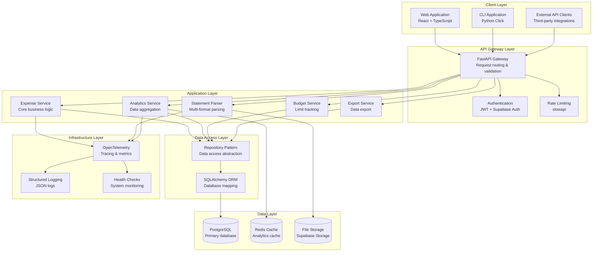
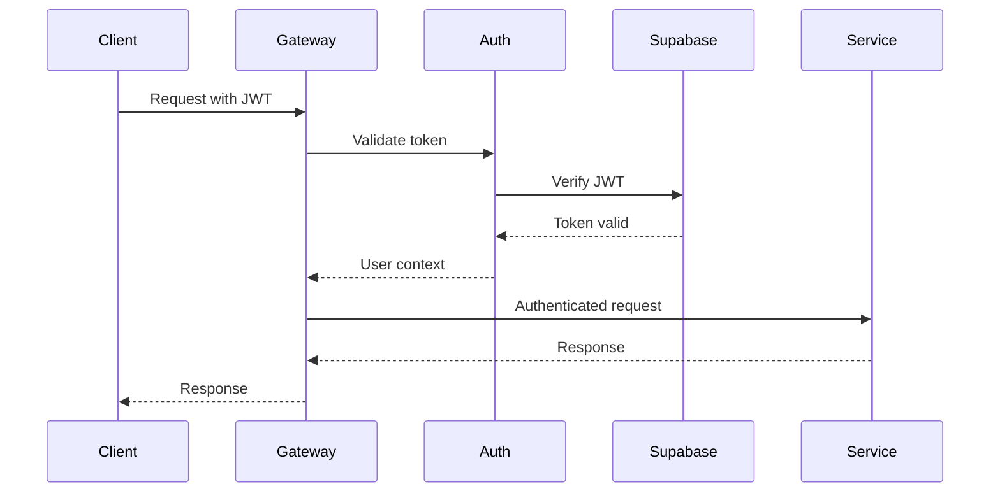
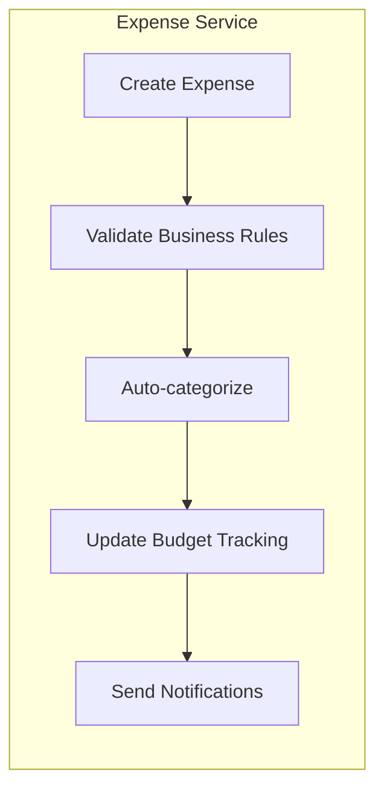
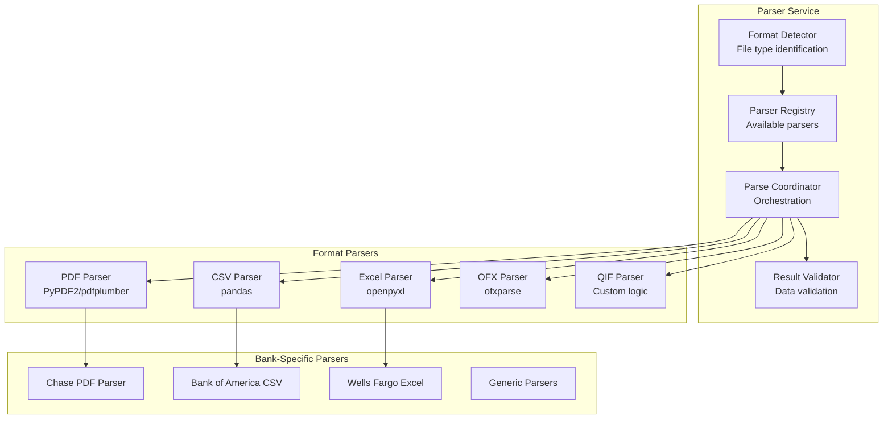
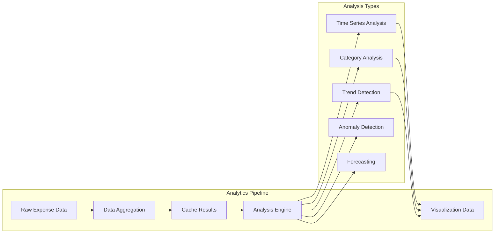
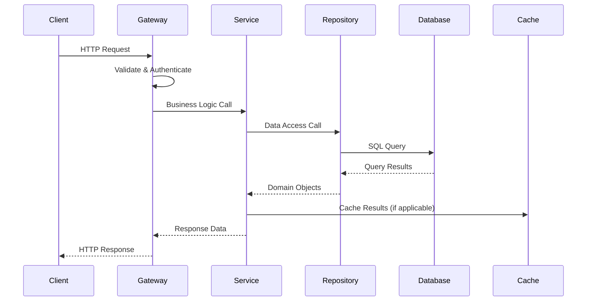
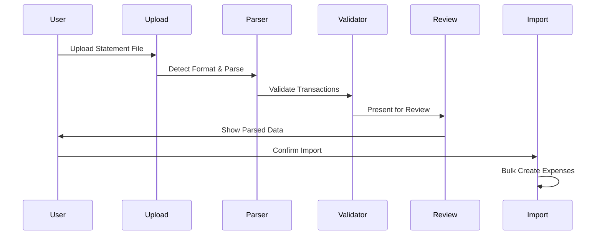
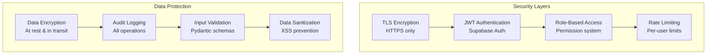

# Architecture Overview

This document provides a comprehensive overview of the Expense Tracker system architecture, design patterns, and component interactions.

## 🏗️ System Architecture

### High-Level Architecture



## 🎯 Design Principles

### 1. Modular Monolith
- **Single Deployable Unit**: All components in one application for operational simplicity
- **Clear Module Boundaries**: Well-defined interfaces between services
- **Shared Database**: Single source of truth with ACID transactions
- **Easy Development**: Simplified debugging and testing

### 2. Interface Agnostic
- **Consistent Business Logic**: Same functionality across web, API, and CLI
- **Shared Service Layer**: Common services used by all interfaces
- **Unified Data Models**: Single set of Pydantic models for validation
- **Cross-Interface Testing**: Ensure feature parity

### 3. Observability First
- **Distributed Tracing**: OpenTelemetry for request tracking
- **Structured Logging**: JSON logs with correlation IDs
- **Metrics Collection**: Business and system metrics
- **Health Monitoring**: Comprehensive health checks

## 🔧 Component Details

### API Gateway Layer

#### FastAPI Gateway
```python
# Request flow through FastAPI
@app.middleware("http")
async def add_correlation_id(request: Request, call_next):
    correlation_id = str(uuid4())
    request.state.correlation_id = correlation_id
    
    with tracer.start_as_current_span("http_request") as span:
        span.set_attribute("correlation_id", correlation_id)
        response = await call_next(request)
        return response
```

**Responsibilities:**
- Request routing and validation
- OpenAPI documentation generation
- CORS handling for web clients
- Error handling and response formatting

#### Authentication Service


**Features:**
- JWT token validation
- User context injection
- Session management
- Role-based access control

### Application Layer

#### Service Architecture Pattern

```python
# Base service pattern
class BaseService:
    def __init__(self, repository: BaseRepository):
        self.repository = repository
        self.logger = logging.getLogger(self.__class__.__name__)
    
    async def create(self, data: CreateSchema) -> Schema:
        with tracer.start_as_current_span("service.create") as span:
            span.set_attributes({"service": self.__class__.__name__})
            return await self.repository.create(data)
```

#### Expense Service
**Core Responsibilities:**
- CRUD operations for expenses
- Business rule validation
- Category assignment logic
- Recurring expense handling



#### Statement Parser Service
**Modular Parser Architecture:**



**Parser Interface:**
```python
class StatementParser(ABC):
    @abstractmethod
    async def can_parse(self, file: UploadFile) -> bool:
        """Check if this parser can handle the file"""
        pass
    
    @abstractmethod
    async def parse(self, file: UploadFile) -> ParseResult:
        """Parse the file and return transactions"""
        pass
    
    @abstractmethod
    def get_confidence_score(self) -> float:
        """Return confidence in parsing accuracy"""
        pass
```

#### Analytics Service
**Data Processing Pipeline:**



### Data Access Layer

#### Repository Pattern
**Benefits:**
- Abstraction over database operations
- Testable business logic
- Consistent data access patterns
- Easy to mock for testing

```python
# Repository interface
class ExpenseRepository(BaseRepository):
    async def get_by_date_range(
        self, 
        start_date: date, 
        end_date: date,
        filters: Optional[Dict] = None
    ) -> List[Expense]:
        # Implementation with optimized queries
        pass
    
    async def get_analytics_data(
        self, 
        period: str,
        grouping: str
    ) -> List[AnalyticsResult]:
        # Specialized analytics queries
        pass
```

#### SQLAlchemy ORM
**Configuration:**
- Async SQLAlchemy for non-blocking database operations
- Connection pooling for performance
- Automatic relationship loading optimization
- Query optimization with indexes

## 🔄 Data Flow Patterns

### Request Processing Flow



### Statement Processing Flow



## 🚀 Performance Considerations

### Database Optimization
- **Indexing Strategy**: Composite indexes for common query patterns
- **Connection Pooling**: Async connection pool with proper sizing
- **Query Optimization**: N+1 query prevention with eager loading
- **Pagination**: Cursor-based pagination for large datasets

### Caching Strategy
- **Analytics Cache**: Redis for expensive analytics calculations
- **Query Result Cache**: Cache frequently accessed data
- **Application Cache**: In-memory caching for configuration data
- **CDN**: Static asset caching for frontend

### Async Processing
- **Background Jobs**: Celery for heavy processing tasks
- **File Processing**: Async file upload and parsing
- **Batch Operations**: Bulk database operations for imports
- **Event-Driven**: Async event handling for notifications

## 🔒 Security Architecture

### Authentication & Authorization


### Data Privacy
- **PII Protection**: Encryption of sensitive financial data
- **Access Logging**: Comprehensive audit trails
- **Data Retention**: Configurable retention policies
- **GDPR Compliance**: Right to deletion and data export

## 📊 Monitoring & Observability

### OpenTelemetry Implementation
```python
# Tracing setup
from opentelemetry import trace
from opentelemetry.exporter.jaeger.thrift import JaegerExporter
from opentelemetry.sdk.trace import TracerProvider
from opentelemetry.sdk.trace.export import BatchSpanProcessor

# Configure tracing
trace.set_tracer_provider(TracerProvider())
tracer = trace.get_tracer(__name__)

jaeger_exporter = JaegerExporter(
    agent_host_name="localhost",
    agent_port=6831,
)

span_processor = BatchSpanProcessor(jaeger_exporter)
trace.get_tracer_provider().add_span_processor(span_processor)
```

### Metrics Collection
- **Business Metrics**: Expenses created, statements parsed, budgets exceeded
- **System Metrics**: Response times, error rates, database performance
- **User Metrics**: Active users, feature usage, session duration
- **Infrastructure Metrics**: CPU, memory, disk usage

### Health Monitoring
```python
@app.get("/health")
async def health_check():
    return {
        "status": "healthy",
        "timestamp": datetime.utcnow(),
        "version": app.version,
        "database": await check_database_health(),
        "cache": await check_cache_health(),
        "storage": await check_storage_health()
    }
```

## 🔄 Deployment Architecture

### Development Environment
- **Local Database**: PostgreSQL in Docker
- **Hot Reload**: FastAPI and React dev servers
- **Debug Tools**: Database GUI, API documentation
- **Testing**: Automated test suites

### Production Environment
- **Backend**: Railway/Fly.io with auto-scaling
- **Frontend**: Vercel with CDN
- **Database**: Supabase managed PostgreSQL
- **Storage**: Supabase Storage for file uploads
- **Monitoring**: Integrated observability stack

This architecture provides a solid foundation for a scalable, maintainable expense tracking system while maintaining simplicity in development and operations.