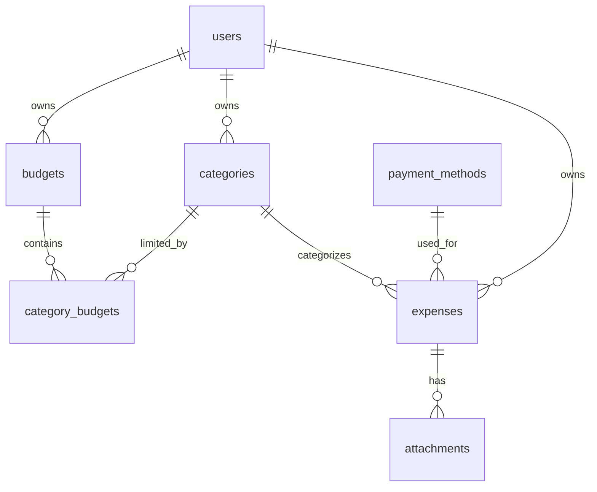
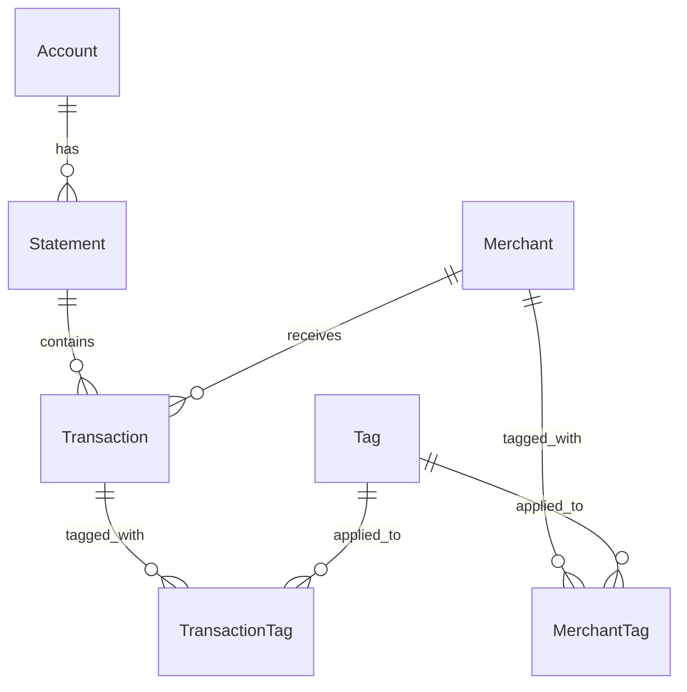

# Schema Comparison & Recommendations

This document compares our current expense tracker schema with the provided bank statement schema and provides recommendations for improvements.

## �  Schema Comparison

### Current Expense Tracker Schema


### Bank Statement Schema (Provided)


## 🎯 Key Insights from Bank Statement Schema

### 1. **Merchant-Centric Approach** ⭐⭐⭐
**Current**: Categories are manually assigned per expense
**Bank Schema**: Merchants are first-class entities with inherited tags

**Benefits:**
- Automatic categorization based on merchant
- Consistent tagging across all transactions with same merchant
- Better analytics by merchant/vendor
- Reduces manual categorization effort

### 2. **Flexible Tagging System** ⭐⭐⭐
**Current**: Single category per expense
**Bank Schema**: Multiple tags per merchant + transaction-level tag overrides

**Benefits:**
- Multi-dimensional categorization (e.g., "Groceries" + "Kids" + "Organic")
- Exception handling (tag individual transactions differently)
- More granular analytics
- Better for complex expense scenarios

### 3. **Statement Import Tracking** ⭐⭐
**Current**: No import tracking
**Bank Schema**: Full statement metadata with balances and periods

**Benefits:**
- Duplicate detection
- Reconciliation capabilities
- Import audit trail
- Better data integrity

### 4. **Account-Centric Organization** ⭐
**Current**: Payment methods are simple entities
**Bank Schema**: Rich account information with IBAN, BIC, etc.

**Benefits:**
- Better for multiple bank accounts
- International banking support
- More detailed financial tracking

## 🚀 Recommended Schema Enhancements

### Priority 1: Add Merchant Entity (HIGH IMPACT)

```sql
CREATE TABLE merchants (
    id UUID PRIMARY KEY DEFAULT gen_random_uuid(),
    name VARCHAR(255) NOT NULL,
    normalized_name VARCHAR(255) NOT NULL, -- For matching
    address TEXT,
    merchant_identifier VARCHAR(100), -- External ID
    category_id UUID REFERENCES categories(id), -- Default category
    notes TEXT,
    user_id UUID REFERENCES users(id) NOT NULL,
    created_at TIMESTAMP DEFAULT NOW(),
    updated_at TIMESTAMP DEFAULT NOW()
);

CREATE INDEX idx_merchants_normalized_name ON merchants(normalized_name);
CREATE INDEX idx_merchants_user ON merchants(user_id);

-- Update expenses to reference merchants
ALTER TABLE expenses ADD COLUMN merchant_id UUID REFERENCES merchants(id);
```

### Priority 2: Implement Flexible Tagging (HIGH IMPACT)

```sql
CREATE TABLE tags (
    id UUID PRIMARY KEY DEFAULT gen_random_uuid(),
    name VARCHAR(100) UNIQUE NOT NULL,
    color VARCHAR(7) DEFAULT '#6B7280',
    icon VARCHAR(50),
    user_id UUID REFERENCES users(id) NOT NULL,
    created_at TIMESTAMP DEFAULT NOW()
);

-- Merchant tags (default tags for all transactions with this merchant)
CREATE TABLE merchant_tags (
    merchant_id UUID REFERENCES merchants(id),
    tag_id UUID REFERENCES tags(id),
    PRIMARY KEY (merchant_id, tag_id)
);

-- Transaction tags (override or additional tags for specific expenses)
CREATE TABLE expense_tags (
    expense_id UUID REFERENCES expenses(id),
    tag_id UUID REFERENCES tags(id),
    PRIMARY KEY (expense_id, tag_id)
);
```

### Priority 3: Enhanced Statement Import (MEDIUM IMPACT)

```sql
CREATE TABLE accounts (
    id UUID PRIMARY KEY DEFAULT gen_random_uuid(),
    name VARCHAR(255) NOT NULL,
    account_number VARCHAR(100),
    bank_code VARCHAR(20),
    iban VARCHAR(34),
    bic VARCHAR(11),
    account_type VARCHAR(50),
    currency VARCHAR(3) DEFAULT 'USD',
    user_id UUID REFERENCES users(id) NOT NULL,
    created_at TIMESTAMP DEFAULT NOW()
);

CREATE TABLE statement_imports (
    id UUID PRIMARY KEY DEFAULT gen_random_uuid(),
    account_id UUID REFERENCES accounts(id),
    filename VARCHAR(255) NOT NULL,
    file_hash VARCHAR(64) UNIQUE NOT NULL,
    period_start DATE,
    period_end DATE,
    opening_balance DECIMAL(12,2),
    closing_balance DECIMAL(12,2),
    total_debits DECIMAL(12,2),
    total_credits DECIMAL(12,2),
    transaction_count INTEGER,
    imported_count INTEGER,
    status VARCHAR(20) DEFAULT 'pending',
    user_id UUID REFERENCES users(id) NOT NULL,
    created_at TIMESTAMP DEFAULT NOW()
);

-- Link expenses to statement imports
ALTER TABLE expenses ADD COLUMN statement_import_id UUID REFERENCES statement_imports(id);
```

## 🔄 Migration Strategy

### Phase 1: Core Enhancements (Implement with Option A)
1. Add users table with multi-user support
2. Add merchants table
3. Add tags and tagging relationships
4. Update expense model to reference merchants
5. Migrate existing categories to tags

### Phase 2: Statement Processing (Next Sprint)
1. Add accounts table
2. Add statement_imports table
3. Implement merchant auto-detection
4. Add duplicate transaction detection

### Phase 3: Advanced Features (Later)
1. Merchant matching algorithms
2. Auto-tagging based on merchant patterns
3. Statement reconciliation features
4. Advanced analytics with tag combinations

## 📈 Enhanced Analytics Capabilities

### With Merchant + Tags System:

```sql
-- Total spending by merchant (top vendors)
SELECT 
    m.name as merchant_name,
    SUM(e.amount) as total_spent,
    COUNT(e.id) as transaction_count
FROM expenses e
JOIN merchants m ON e.merchant_id = m.id
WHERE e.user_id = $1 AND e.expense_date >= $2
GROUP BY m.id, m.name
ORDER BY total_spent DESC;

-- Multi-dimensional tag analysis
SELECT 
    t.name as tag_name,
    SUM(e.amount) as total_amount,
    COUNT(DISTINCT e.merchant_id) as unique_merchants
FROM expenses e
LEFT JOIN expense_tags et ON e.id = et.expense_id
LEFT JOIN merchant_tags mt ON e.merchant_id = mt.merchant_id
JOIN tags t ON (et.tag_id = t.id OR mt.tag_id = t.id)
WHERE e.user_id = $1
GROUP BY t.id, t.name
ORDER BY total_amount DESC;

-- Find untagged merchants for review
SELECT 
    m.name,
    COUNT(e.id) as transaction_count,
    SUM(e.amount) as total_amount
FROM merchants m
LEFT JOIN merchant_tags mt ON m.id = mt.merchant_id
JOIN expenses e ON m.id = e.merchant_id
WHERE mt.merchant_id IS NULL AND m.user_id = $1
GROUP BY m.id, m.name
ORDER BY total_amount DESC;
```

## 🎯 Recommended Implementation Plan

### Option A Enhanced: Multi-User + Merchant-Centric

```python
# Enhanced models structure
class UserTable(Base):
    # User management
    
class MerchantTable(Base):
    # Merchant entity with auto-categorization
    
class TagTable(Base):
    # Flexible tagging system
    
class ExpenseTable(Base):
    # Links to merchant instead of just category
    merchant_id: UUID
    category_id: UUID  # Keep for backward compatibility
    
class MerchantTagTable(Base):
    # Default tags for merchants
    
class ExpenseTagTable(Base):
    # Override/additional tags for specific expenses
```

## 🔍 Key Differences & Decisions

| Aspect | Current Design | Bank Schema | Recommendation |
|--------|----------------|-------------|----------------|
| **Categorization** | Single category | Merchant + Tags | **Adopt merchant + tags** |
| **Flexibility** | Limited | High | **Adopt tagging system** |
| **Import Tracking** | None | Comprehensive | **Add statement imports** |
| **Account Management** | Simple payment methods | Rich account data | **Enhance gradually** |
| **Data Model** | Expense-centric | Statement-centric | **Hybrid approach** |

## 💡 Final Recommendations

### Implement Now (with Option A):
1. **Multi-user support** - Foundation requirement
2. **Merchant entity** - Game-changer for UX and analytics
3. **Flexible tagging** - Much more powerful than single categories
4. **Basic statement import tracking** - Needed for parsing features

### Benefits of This Approach:
- **Better UX**: Auto-categorization based on merchants
- **Richer Analytics**: Multi-dimensional analysis with tags
- **Future-Proof**: Extensible for complex scenarios
- **Import-Ready**: Built for statement processing from day 1

### Implementation Effort:
- **Additional Time**: +4-6 hours to current task
- **Complexity**: Medium (well-defined patterns)
- **Risk**: Low (proven schema design)

This enhanced schema combines the best of both approaches: the simplicity of our current design with the power and flexibility of the merchant-centric bank statement schema. It positions us perfectly for advanced features while maintaining clean, normalized data structures.

**Should we proceed with this enhanced Option A approach?**