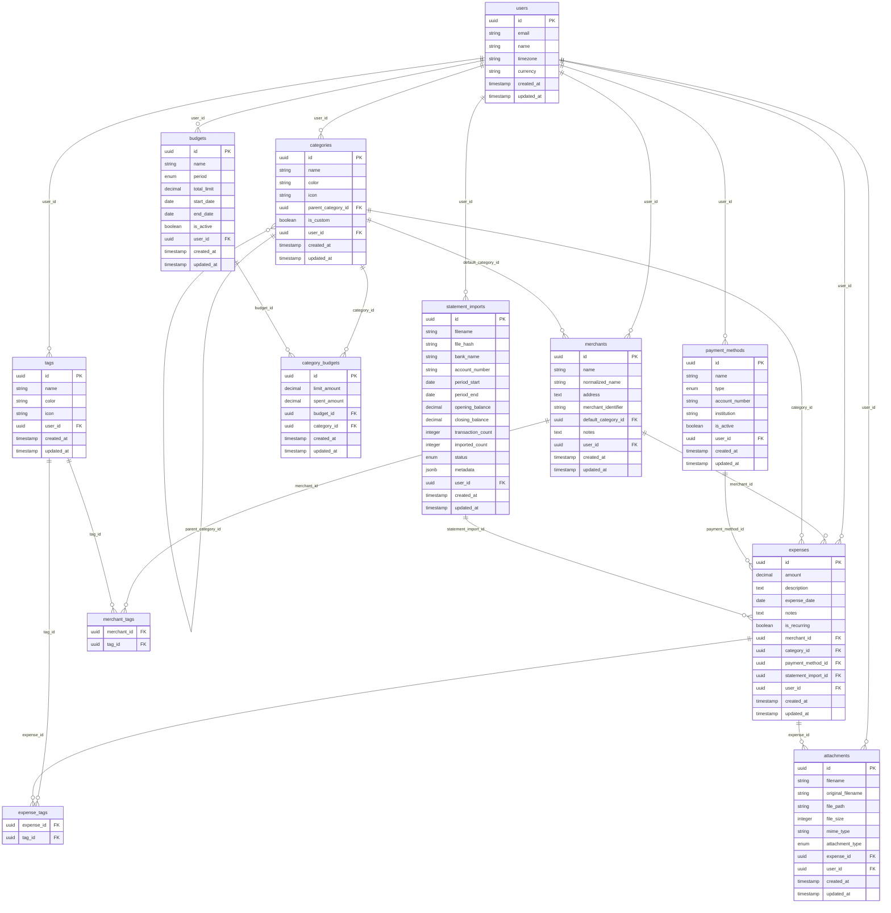

# Database Schema Documentation

This document provides a comprehensive overview of the Expense Tracker database schema, including entity relationships, constraints, and design decisions.

## 📊 Entity Relationship Diagram



## 🏗️ Table Definitions

### Core Entities

#### `categories`
Stores expense categories with hierarchical support.

| Column | Type | Constraints | Description |
|--------|------|-------------|-------------|
| `id` | UUID | PRIMARY KEY | Unique identifier |
| `name` | VARCHAR(100) | NOT NULL, INDEX | Category name |
| `color` | VARCHAR(7) | NOT NULL, DEFAULT '#6B7280' | Hex color code |
| `icon` | VARCHAR(50) | NULL | Icon identifier |
| `parent_category_id` | UUID | FOREIGN KEY | Reference to parent category |
| `is_custom` | BOOLEAN | NOT NULL, DEFAULT TRUE | User-created vs system category |
| `created_at` | TIMESTAMP | NOT NULL, DEFAULT NOW() | Creation timestamp |
| `updated_at` | TIMESTAMP | NOT NULL, DEFAULT NOW() | Last update timestamp |

**Indexes:**
- `idx_categories_name` on `name`
- `idx_categories_parent` on `parent_category_id`

**Constraints:**
- Self-referential foreign key for hierarchical categories
- Color must be valid hex format (#RRGGBB)

#### `payment_methods`
Stores different payment methods and accounts.

| Column | Type | Constraints | Description |
|--------|------|-------------|-------------|
| `id` | UUID | PRIMARY KEY | Unique identifier |
| `name` | VARCHAR(100) | NOT NULL, INDEX | Payment method name |
| `type` | ENUM | NOT NULL, INDEX | Payment type (cash, credit_card, etc.) |
| `account_number` | VARCHAR(50) | NULL | Last 4 digits or identifier |
| `institution` | VARCHAR(100) | NULL | Bank or institution name |
| `is_active` | BOOLEAN | NOT NULL, DEFAULT TRUE | Active status |
| `created_at` | TIMESTAMP | NOT NULL, DEFAULT NOW() | Creation timestamp |
| `updated_at` | TIMESTAMP | NOT NULL, DEFAULT NOW() | Last update timestamp |

**Enums:**
- `PaymentType`: cash, credit_card, debit_card, bank_transfer, check, digital_wallet, other

**Indexes:**
- `idx_payment_methods_name` on `name`
- `idx_payment_methods_type` on `type`

#### `expenses`
Core expense tracking table.

| Column | Type | Constraints | Description |
|--------|------|-------------|-------------|
| `id` | UUID | PRIMARY KEY | Unique identifier |
| `amount` | DECIMAL(10,2) | NOT NULL, INDEX | Expense amount |
| `description` | TEXT | NULL | Expense description |
| `expense_date` | DATE | NOT NULL, INDEX | Date of expense |
| `notes` | TEXT | NULL | Additional notes |
| `is_recurring` | BOOLEAN | NOT NULL, DEFAULT FALSE | Recurring expense flag |
| `category_id` | UUID | NOT NULL, FOREIGN KEY, INDEX | Category reference |
| `payment_method_id` | UUID | NOT NULL, FOREIGN KEY, INDEX | Payment method reference |
| `created_at` | TIMESTAMP | NOT NULL, DEFAULT NOW() | Creation timestamp |
| `updated_at` | TIMESTAMP | NOT NULL, DEFAULT NOW() | Last update timestamp |

**Indexes:**
- `idx_expenses_date` on `expense_date`
- `idx_expenses_category` on `category_id`
- `idx_expenses_payment_method` on `payment_method_id`
- `idx_expenses_amount` on `amount`
- `idx_expenses_composite` on `(expense_date, category_id, amount)` for analytics

**Constraints:**
- Amount must be positive
- Foreign key constraints to categories and payment_methods

### Supporting Entities

#### `attachments`
Stores file attachments for expenses (receipts, invoices, etc.).

| Column | Type | Constraints | Description |
|--------|------|-------------|-------------|
| `id` | UUID | PRIMARY KEY | Unique identifier |
| `filename` | VARCHAR(255) | NOT NULL | Stored filename |
| `original_filename` | VARCHAR(255) | NOT NULL | Original filename |
| `file_path` | VARCHAR(500) | NOT NULL | File storage path |
| `file_size` | INTEGER | NOT NULL | File size in bytes |
| `mime_type` | VARCHAR(100) | NOT NULL | MIME type |
| `attachment_type` | ENUM | NOT NULL, DEFAULT 'receipt' | Attachment type |
| `expense_id` | UUID | NOT NULL, FOREIGN KEY, INDEX | Expense reference |
| `created_at` | TIMESTAMP | NOT NULL, DEFAULT NOW() | Creation timestamp |
| `updated_at` | TIMESTAMP | NOT NULL, DEFAULT NOW() | Last update timestamp |

**Enums:**
- `AttachmentType`: receipt, invoice, document, image, other

**Indexes:**
- `idx_attachments_expense` on `expense_id`

#### `budgets`
Budget definitions and periods.

| Column | Type | Constraints | Description |
|--------|------|-------------|-------------|
| `id` | UUID | PRIMARY KEY | Unique identifier |
| `name` | VARCHAR(100) | NOT NULL, INDEX | Budget name |
| `period` | ENUM | NOT NULL, DEFAULT 'monthly' | Budget period |
| `total_limit` | DECIMAL(10,2) | NULL | Total budget limit |
| `start_date` | DATE | NOT NULL, INDEX | Budget start date |
| `end_date` | DATE | NULL, INDEX | Budget end date |
| `is_active` | BOOLEAN | NOT NULL, DEFAULT TRUE | Active status |
| `created_at` | TIMESTAMP | NOT NULL, DEFAULT NOW() | Creation timestamp |
| `updated_at` | TIMESTAMP | NOT NULL, DEFAULT NOW() | Last update timestamp |

**Enums:**
- `BudgetPeriod`: monthly, quarterly, yearly, custom

**Indexes:**
- `idx_budgets_name` on `name`
- `idx_budgets_dates` on `(start_date, end_date)`

#### `category_budgets`
Category-specific budget limits within a budget.

| Column | Type | Constraints | Description |
|--------|------|-------------|-------------|
| `id` | UUID | PRIMARY KEY | Unique identifier |
| `limit_amount` | DECIMAL(10,2) | NOT NULL | Category budget limit |
| `spent_amount` | DECIMAL(10,2) | NOT NULL, DEFAULT 0 | Amount spent |
| `budget_id` | UUID | NOT NULL, FOREIGN KEY, INDEX | Budget reference |
| `category_id` | UUID | NOT NULL, FOREIGN KEY, INDEX | Category reference |
| `created_at` | TIMESTAMP | NOT NULL, DEFAULT NOW() | Creation timestamp |
| `updated_at` | TIMESTAMP | NOT NULL, DEFAULT NOW() | Last update timestamp |

**Indexes:**
- `idx_category_budgets_budget` on `budget_id`
- `idx_category_budgets_category` on `category_id`
- `idx_category_budgets_composite` on `(budget_id, category_id)` UNIQUE

## 🔍 Query Patterns

### Common Analytics Queries

#### Monthly Spending by Category
```sql
SELECT 
    c.name as category_name,
    SUM(e.amount) as total_amount,
    COUNT(e.id) as expense_count
FROM expenses e
JOIN categories c ON e.category_id = c.id
WHERE e.expense_date >= '2024-01-01' 
  AND e.expense_date < '2024-02-01'
GROUP BY c.id, c.name
ORDER BY total_amount DESC;
```

#### Budget vs Actual Spending
```sql
SELECT 
    b.name as budget_name,
    c.name as category_name,
    cb.limit_amount,
    cb.spent_amount,
    (cb.spent_amount / cb.limit_amount * 100) as percentage_used
FROM category_budgets cb
JOIN budgets b ON cb.budget_id = b.id
JOIN categories c ON cb.category_id = c.id
WHERE b.is_active = true
  AND CURRENT_DATE BETWEEN b.start_date AND COALESCE(b.end_date, CURRENT_DATE);
```

#### Expense Trends Over Time
```sql
SELECT 
    DATE_TRUNC('month', expense_date) as month,
    SUM(amount) as total_amount,
    COUNT(*) as expense_count,
    AVG(amount) as avg_amount
FROM expenses
WHERE expense_date >= CURRENT_DATE - INTERVAL '12 months'
GROUP BY DATE_TRUNC('month', expense_date)
ORDER BY month;
```

## 🚀 Performance Considerations

### Indexing Strategy

1. **Primary Access Patterns**
   - Date-based queries: `idx_expenses_date`
   - Category filtering: `idx_expenses_category`
   - Payment method filtering: `idx_expenses_payment_method`

2. **Analytics Queries**
   - Composite index for common analytics: `idx_expenses_composite`
   - Budget date ranges: `idx_budgets_dates`

3. **Foreign Key Performance**
   - All foreign keys have corresponding indexes
   - Unique constraints on logical keys

### Data Types

- **UUIDs**: Used for all primary keys for better distribution and security
- **DECIMAL**: Used for monetary amounts to avoid floating-point precision issues
- **DATE vs TIMESTAMP**: Expense dates use DATE type for better query performance
- **TEXT vs VARCHAR**: TEXT for variable-length content, VARCHAR for constrained fields

## 🔒 Security Considerations

### Data Protection

1. **Sensitive Data**
   - Payment method account numbers are masked (last 4 digits only)
   - File paths are relative to prevent directory traversal
   - No direct storage of financial account credentials

2. **Access Control**
   - All tables include created_at/updated_at for audit trails
   - Foreign key constraints prevent orphaned records
   - Enum constraints prevent invalid data states

### Backup Strategy

1. **Regular Backups**
   - Daily automated backups of the entire database
   - Point-in-time recovery capability
   - Encrypted backup storage

2. **Data Retention**
   - Soft delete patterns for important records
   - Configurable retention periods for different data types
   - GDPR compliance for data deletion requests

## 🔄 Migration Strategy

### Alembic Migrations

The database schema is managed through Alembic migrations:

```bash
# Create a new migration
alembic revision --autogenerate -m "Description"

# Apply migrations
alembic upgrade head

# Rollback migrations
alembic downgrade -1
```

### Schema Evolution

1. **Backward Compatibility**
   - New columns are nullable or have defaults
   - Existing columns are not removed without deprecation
   - Enum values are additive

2. **Data Migration**
   - Complex schema changes include data migration scripts
   - Validation queries to ensure data integrity
   - Rollback procedures for failed migrations

This schema design provides a solid foundation for the expense tracking system while maintaining flexibility for future enhancements.